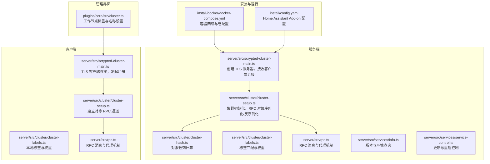
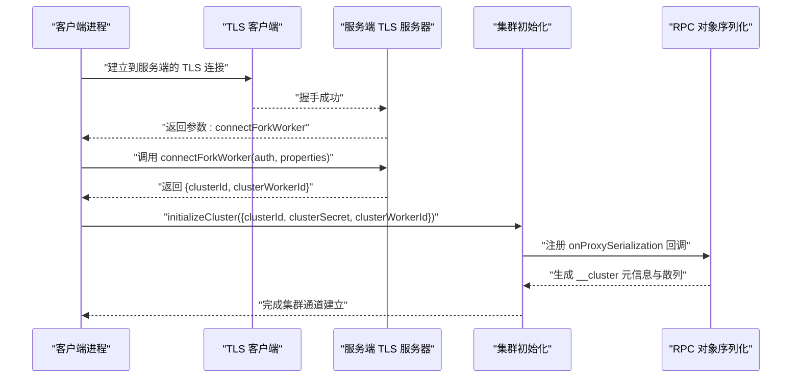
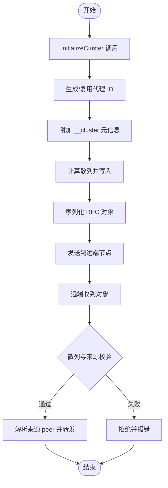
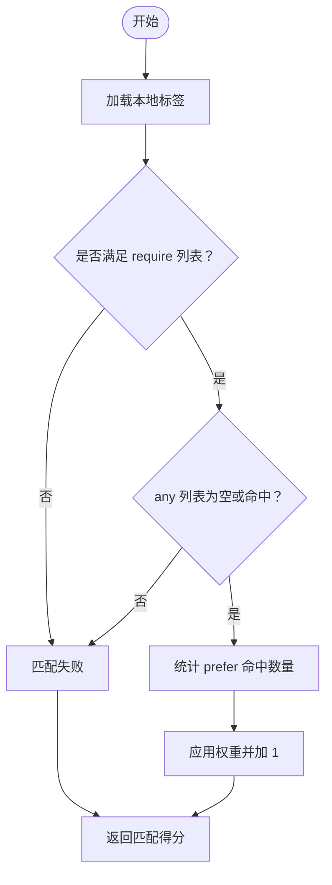
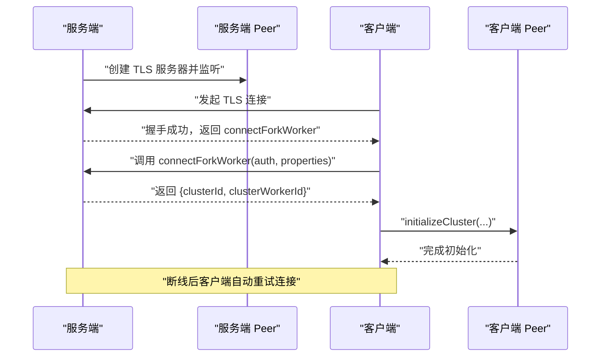
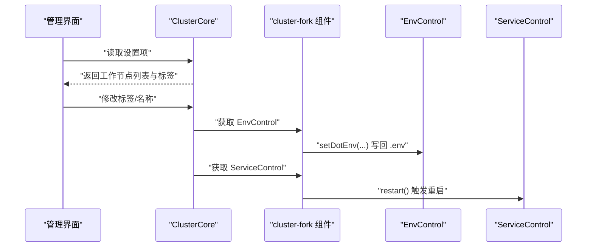
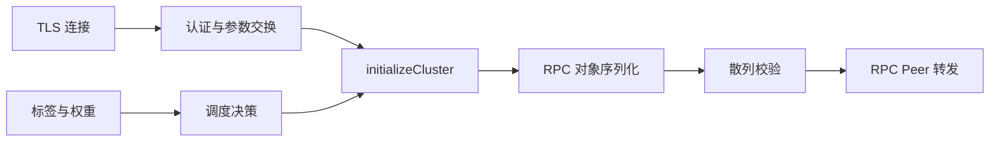

# 集群配置

<cite>
**本文引用的文件**
- [plugins/core/src/cluster.ts](file://plugins/core/src/cluster.ts)
- [server/src/cluster/cluster-setup.ts](file://server/src/cluster/cluster-setup.ts)
- [server/src/cluster/cluster-hash.ts](file://server/src/cluster/cluster-hash.ts)
- [server/src/cluster/cluster-labels.ts](file://server/src/cluster/cluster-labels.ts)
- [server/src/cluster/connect-rpc-object.ts](file://server/src/cluster/connect-rpc-object.ts)
- [server/src/scrypted-cluster-main.ts](file://server/src/scrypted-cluster-main.ts)
- [server/src/rpc.ts](file://server/src/rpc.ts)
- [server/src/services/info.ts](file://server/src/services/info.ts)
- [server/src/services/service-control.ts](file://server/src/services/service-control.ts)
- [install/docker/docker-compose.yml](file://install/docker/docker-compose.yml)
- [install/config.yaml](file://install/config.yaml)
</cite>

## 目录
1. [简介](#简介)
2. [项目结构](#项目结构)
3. [核心组件](#核心组件)
4. [架构总览](#架构总览)
5. [详细组件分析](#详细组件分析)
6. [依赖关系分析](#依赖关系分析)
7. [性能考量](#性能考量)
8. [故障排查指南](#故障排查指南)
9. [结论](#结论)
10. [附录](#附录)

## 简介
本指南面向在生产环境中部署 Scrypted 集群的用户，围绕集群架构设计与实现进行系统化说明，涵盖以下主题：
- 集群模式与节点角色：主节点（服务器）与从节点（客户端）职责划分
- 节点发现与认证：基于 TLS 的连接、基于散列的密钥校验
- 负载均衡与标签调度：通过标签匹配与权重选择目标工作节点
- 初始化配置：集群密钥生成、节点注册流程、网络拓扑规划
- 分布式存储：NVR 存储卷挂载与路径规划
- 服务发现与 RPC 通信：对象序列化、代理转发、故障检测与自动重连
- 扩容与缩容：节点添加、数据迁移、服务重启
- 监控与更新：版本信息、更新触发、健康状态
- 故障恢复：节点宕机处理、数据修复、服务切换
- 安全配置：节点认证、通信加密、访问控制

## 项目结构
Scrypted 集群能力由服务端与客户端两部分协作实现，并通过 RPC 对象跨进程/跨节点传递。安装与运行层面提供了 Docker Compose 与 Home Assistant Add-on 的示例配置。

**图示来源**
- [server/src/scrypted-cluster-main.ts:332-409](file://server/src/scrypted-cluster-main.ts#L332-L409)
- [server/src/cluster/cluster-setup.ts:38-399](file://server/src/cluster/cluster-setup.ts#L38-L399)
- [server/src/cluster/cluster-hash.ts:4-7](file://server/src/cluster/cluster-hash.ts#L4-L7)
- [server/src/cluster/cluster-labels.ts:37-57](file://server/src/cluster/cluster-labels.ts#L37-L57)
- [server/src/rpc.ts:29-200](file://server/src/rpc.ts#L29-L200)
- [plugins/core/src/cluster.ts:27-101](file://plugins/core/src/cluster.ts#L27-L101)
- [install/docker/docker-compose.yml:20-169](file://install/docker/docker-compose.yml#L20-L169)
- [install/config.yaml:1-49](file://install/config.yaml#L1-L49)

**章节来源**
- [server/src/scrypted-cluster-main.ts:332-409](file://server/src/scrypted-cluster-main.ts#L332-L409)
- [server/src/cluster/cluster-setup.ts:38-399](file://server/src/cluster/cluster-setup.ts#L38-L399)
- [server/src/cluster/cluster-hash.ts:4-7](file://server/src/cluster/cluster-hash.ts#L4-L7)
- [server/src/cluster/cluster-labels.ts:37-57](file://server/src/cluster/cluster-labels.ts#L37-L57)
- [server/src/rpc.ts:29-200](file://server/src/rpc.ts#L29-L200)
- [plugins/core/src/cluster.ts:27-101](file://plugins/core/src/cluster.ts#L27-L101)
- [install/docker/docker-compose.yml:20-169](file://install/docker/docker-compose.yml#L20-L169)
- [install/config.yaml:1-49](file://install/config.yaml#L1-L49)

## 核心组件
- 集群模式与角色
  - 服务端（服务器）：监听 TLS 端口，验证客户端身份，分配工作节点标识，提供 RPC 服务。
  - 客户端（从节点）：通过 TLS 连接服务端，提交认证信息与标签，完成注册后参与 RPC 通信。
- RPC 对象序列化与反序列化
  - 在对象序列化时生成稳定代理 ID，并附带来源节点信息与散列值；反序列化时根据散列与来源键进行校验与路由。
- 标签与权重
  - 通过环境变量与 .env 设置标签，支持“必须满足”“任选其一”“优先匹配”，并可设置权重用于调度。
- 服务控制与信息
  - 提供版本查询与环境变量导出，支持通过 Webhook 触发更新或写入标记文件触发重启。

**章节来源**
- [server/src/cluster/cluster-setup.ts:38-399](file://server/src/cluster/cluster-setup.ts#L38-L399)
- [server/src/cluster/connect-rpc-object.ts:1-29](file://server/src/cluster/connect-rpc-object.ts#L1-L29)
- [server/src/cluster/cluster-labels.ts:4-57](file://server/src/cluster/cluster-labels.ts#L4-L57)
- [server/src/services/info.ts:3-16](file://server/src/services/info.ts#L3-L16)
- [server/src/services/service-control.ts:4-32](file://server/src/services/service-control.ts#L4-L32)

## 架构总览
下图展示了集群启动到 RPC 通信的关键交互流程，包括 TLS 建立、认证、对象序列化与代理转发。

**图示来源**
- [server/src/scrypted-cluster-main.ts:213-330](file://server/src/scrypted-cluster-main.ts#L213-L330)
- [server/src/cluster/cluster-setup.ts:336-399](file://server/src/cluster/cluster-setup.ts#L336-L399)
- [server/src/cluster/cluster-hash.ts:4-7](file://server/src/cluster/cluster-hash.ts#L4-L7)

**章节来源**
- [server/src/scrypted-cluster-main.ts:213-330](file://server/src/scrypted-cluster-main.ts#L213-L330)
- [server/src/cluster/cluster-setup.ts:336-399](file://server/src/cluster/cluster-setup.ts#L336-L399)

## 详细组件分析

### 组件 A：集群初始化与 RPC 对象序列化
- 初始化流程
  - 服务端创建 TLS 服务器，等待客户端连接；客户端发起 TLS 握手后，双方交换参数以完成注册。
  - 注册完成后，客户端调用 initializeCluster，服务端在当前 peer 上注册对象序列化回调，确保后续 RPC 对象携带来源信息与散列。
- 对象序列化
  - 生成全局稳定的代理 ID；若存在旧条目且来源不一致则清空，避免竞态。
  - 为每个对象附加 __cluster 条目，包含集群 ID、地址、端口、代理 ID、来源键与散列。
  - 散列使用 SHA-256，输入包含对象关键字段与共享密钥，防止伪造与篡改。
- 反序列化与连接
  - 客户端收到远端对象时，先校验散列与来源；若目标在同一节点上则直接返回本地对象，否则通过已建立的 peer 进行代理转发。

**图示来源**
- [server/src/cluster/cluster-setup.ts:302-335](file://server/src/cluster/cluster-setup.ts#L302-L335)
- [server/src/cluster/cluster-hash.ts:4-7](file://server/src/cluster/cluster-hash.ts#L4-L7)
- [server/src/cluster/connect-rpc-object.ts:1-29](file://server/src/cluster/connect-rpc-object.ts#L1-L29)

**章节来源**
- [server/src/cluster/cluster-setup.ts:302-335](file://server/src/cluster/cluster-setup.ts#L302-L335)
- [server/src/cluster/cluster-hash.ts:4-7](file://server/src/cluster/cluster-hash.ts#L4-L7)
- [server/src/cluster/connect-rpc-object.ts:1-29](file://server/src/cluster/connect-rpc-object.ts#L1-L29)

### 组件 B：标签匹配与权重调度
- 标签匹配规则
  - 必须满足（require）：全部命中才有效。
  - 任选其一（any）：至少命中一个即有效。
  - 优先匹配（prefer）：命中越多权重越高。
- 权重
  - 支持通过环境变量设置权重，数值越大越倾向被选中。
- 本地标签
  - 从环境变量读取标签列表，同时注入架构、平台与主机名，去重后作为候选。

**图示来源**
- [server/src/cluster/cluster-labels.ts:4-57](file://server/src/cluster/cluster-labels.ts#L4-L57)

**章节来源**
- [server/src/cluster/cluster-labels.ts:4-57](file://server/src/cluster/cluster-labels.ts#L4-L57)

### 组件 C：服务端与客户端生命周期与重连
- 服务端
  - 创建 TLS 服务器，接受客户端连接；为每个客户端维护 peer，记录标签、权重、地址与模式。
  - 认证阶段校验散列与地址端口一致性；认证通过后分配工作节点 ID 并注册参数。
- 客户端
  - 通过 TLS 连接服务端，提交本地标签与权重；认证通过后初始化集群通道。
  - 若连接断开，客户端会持续重试连接，直至成功。

**图示来源**
- [server/src/scrypted-cluster-main.ts:332-409](file://server/src/scrypted-cluster-main.ts#L332-L409)
- [server/src/scrypted-cluster-main.ts:213-330](file://server/src/scrypted-cluster-main.ts#L213-L330)

**章节来源**
- [server/src/scrypted-cluster-main.ts:332-409](file://server/src/scrypted-cluster-main.ts#L332-L409)
- [server/src/scrypted-cluster-main.ts:213-330](file://server/src/scrypted-cluster-main.ts#L213-L330)

### 组件 D：管理界面与工作节点配置
- 工作节点管理
  - 通过插件界面展示各工作节点的名称、模式与标签。
  - 支持修改标签与名称，修改后通过环境控制写回 .env，并触发对应工作节点的服务重启。
- 标签与名称来源
  - 标签来自 .env 中的 SCRYPTED_CLUSTER_LABELS，名称来自 SCRYPTED_CLUSTER_WORKER_NAME。

**图示来源**
- [plugins/core/src/cluster.ts:27-101](file://plugins/core/src/cluster.ts#L27-L101)
- [plugins/core/src/cluster.ts:103-155](file://plugins/core/src/cluster.ts#L103-L155)

**章节来源**
- [plugins/core/src/cluster.ts:27-101](file://plugins/core/src/cluster.ts#L27-L101)
- [plugins/core/src/cluster.ts:103-155](file://plugins/core/src/cluster.ts#L103-L155)

## 依赖关系分析
- 组件耦合
  - 服务端与客户端通过 TLS 与 RPC 参数交换实现解耦；认证与对象序列化逻辑集中在集群初始化模块。
  - 标签匹配与权重调度独立于 RPC 层，便于在不同场景下灵活配置。
- 外部依赖
  - 容器运行依赖 Docker Compose 或 Home Assistant Add-on；NVR 存储可通过网络卷挂载。
  - 更新机制可通过 Webhook 或标记文件触发。

**图示来源**
- [server/src/scrypted-cluster-main.ts:213-330](file://server/src/scrypted-cluster-main.ts#L213-L330)
- [server/src/cluster/cluster-setup.ts:336-399](file://server/src/cluster/cluster-setup.ts#L336-L399)
- [server/src/cluster/cluster-labels.ts:4-57](file://server/src/cluster/cluster-labels.ts#L4-L57)

**章节来源**
- [server/src/scrypted-cluster-main.ts:213-330](file://server/src/scrypted-cluster-main.ts#L213-L330)
- [server/src/cluster/cluster-setup.ts:336-399](file://server/src/cluster/cluster-setup.ts#L336-L399)
- [server/src/cluster/cluster-labels.ts:4-57](file://server/src/cluster/cluster-labels.ts#L4-L57)

## 性能考量
- 对象序列化与散列
  - 对象散列计算与代理 ID 生成在序列化阶段完成，避免重复计算；建议合理设置标签以减少不必要的重连与切换。
- 网络与连接
  - 客户端采用 keepAlive 与自动重连策略，降低网络抖动影响；服务端为每个客户端维护独立 peer，避免阻塞。
- 资源与日志
  - 容器日志驱动可按需关闭以减少闪存磨损；必要时启用文件日志以便调试。

[本节为通用指导，无需具体文件分析]

## 故障排查指南
- TLS 握手失败
  - 检查服务端证书与客户端信任策略；确认网络可达性与防火墙放行。
- 认证失败
  - 核对 SCRYPTED_CLUSTER_SECRET 是否一致；确认客户端地址与端口与服务端记录一致。
- 对象散列不匹配
  - 排查共享密钥与对象元信息是否被篡改；检查网络中间层是否修改了消息。
- 自动重连无效
  - 查看客户端日志中的重连间隔与错误提示；确认服务端未因异常退出导致 peer 被清理。
- 更新与重启
  - 使用 Webhook 触发更新或写入 .update 文件后触发重启；确认权限与路径正确。

**章节来源**
- [server/src/scrypted-cluster-main.ts:242-329](file://server/src/scrypted-cluster-main.ts#L242-L329)
- [server/src/services/service-control.ts:4-32](file://server/src/services/service-control.ts#L4-L32)

## 结论
Scrypted 集群通过 TLS 与 RPC 对象序列化实现高可靠、可扩展的多节点架构。借助标签与权重调度，可在存储与计算节点之间实现灵活的任务分配。配合容器化部署与 Webhook 更新机制，可快速完成初始化、扩容与运维操作。建议在生产环境中严格管理集群密钥、网络拓扑与存储卷挂载，并结合监控与日志进行持续优化。

[本节为总结，无需具体文件分析]

## 附录

### A. 集群初始化配置步骤
- 生成集群密钥
  - 在所有节点与服务端设置相同的 SCRYPTED_CLUSTER_SECRET。
- 规划网络拓扑
  - 明确服务端监听地址（SCRYPTED_CLUSTER_ADDRESS 或 SCRYPTED_CLUSTER_SERVER），确保客户端可访问。
- 启动服务端
  - 设置 SCRYPTED_CLUSTER_MODE=server，启动 TLS 服务器。
- 启动客户端
  - 设置 SCRYPTED_CLUSTER_MODE=client 与 SCRYPTED_CLUSTER_SERVER，启动客户端并自动注册。
- 验证注册
  - 通过管理界面查看工作节点列表与标签，确认认证与初始化成功。

**章节来源**
- [server/src/cluster/cluster-setup.ts:403-462](file://server/src/cluster/cluster-setup.ts#L403-L462)
- [server/src/scrypted-cluster-main.ts:213-330](file://server/src/scrypted-cluster-main.ts#L213-L330)

### B. 分布式存储配置（NVR）
- Docker Compose
  - 使用 volumes 将主机目录或网络卷挂载至容器内的 /nvr；可参考示例注释启用 SMB/CIFS 或 NFS。
- Home Assistant Add-on
  - 通过映射外部存储路径到 /data/scrypted_nvr，确保权限与可用空间充足。
- 注意事项
  - 确保多节点可访问同一存储；避免频繁断电导致数据损坏。

**章节来源**
- [install/docker/docker-compose.yml:58-91](file://install/docker/docker-compose.yml#L58-L91)
- [install/config.yaml:24-29](file://install/config.yaml#L24-L29)

### C. 服务发现与 RPC 通信配置
- 服务发现
  - 客户端通过 SCRYPTED_CLUSTER_SERVER 发现服务端；服务端可绑定到指定地址或回环地址。
- RPC 通信
  - 对象序列化时附带来源键与散列；远端节点通过来源键定位 peer 并进行代理转发。
- 故障检测与自动重连
  - 客户端保持长连接并定期重试；服务端为每个客户端维护独立 peer，断线后清理并等待重连。

**章节来源**
- [server/src/cluster/cluster-setup.ts:38-399](file://server/src/cluster/cluster-setup.ts#L38-L399)
- [server/src/rpc.ts:29-200](file://server/src/rpc.ts#L29-L200)

### D. 扩容与缩容操作指南
- 扩容
  - 新增客户端节点：设置 SCRYPTED_CLUSTER_MODE=client 与 SCRYPTED_CLUSTER_SERVER，启动后自动注册。
  - 调整标签与权重：通过管理界面修改标签或权重，触发对应工作节点重启以应用新配置。
- 缩容
  - 逐个停止客户端节点，确认无任务在该节点运行后再移除；服务端会自动清理离线节点。
- 数据迁移
  - NVR 存储位于共享卷时，可直接迁移；注意迁移期间暂停写入并校验一致性。

**章节来源**
- [plugins/core/src/cluster.ts:103-155](file://plugins/core/src/cluster.ts#L103-L155)
- [server/src/scrypted-cluster-main.ts:213-330](file://server/src/scrypted-cluster-main.ts#L213-L330)

### E. 集群监控配置
- 版本与环境
  - 通过 Info 服务查询版本与 SCRYPTED_* 环境变量，辅助诊断版本与配置问题。
- 更新与重启
  - 通过 Webhook 触发更新或写入 .update 文件后重启；确认更新通道与权限。
- 健康检查
  - 客户端维持长连接并自动重连；服务端记录连接/断开事件，便于观察健康状态。

**章节来源**
- [server/src/services/info.ts:3-16](file://server/src/services/info.ts#L3-L16)
- [server/src/services/service-control.ts:4-32](file://server/src/services/service-control.ts#L4-L32)
- [server/src/scrypted-cluster-main.ts:242-329](file://server/src/scrypted-cluster-main.ts#L242-L329)

### F. 集群安全配置
- 节点认证
  - 使用 SCRYPTED_CLUSTER_SECRET 与对象散列进行双向校验，防止伪造与中间人攻击。
- 通信加密
  - 采用 TLS 加密传输，确保数据完整性与保密性。
- 访问控制
  - 限制服务端监听地址与端口；仅允许受信客户端接入；避免暴露管理端口。

**章节来源**
- [server/src/cluster/cluster-hash.ts:4-7](file://server/src/cluster/cluster-hash.ts#L4-L7)
- [server/src/scrypted-cluster-main.ts:347-409](file://server/src/scrypted-cluster-main.ts#L347-L409)