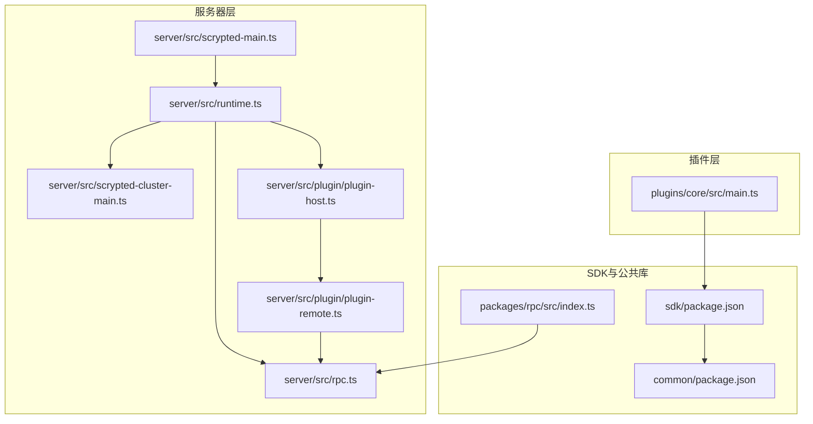
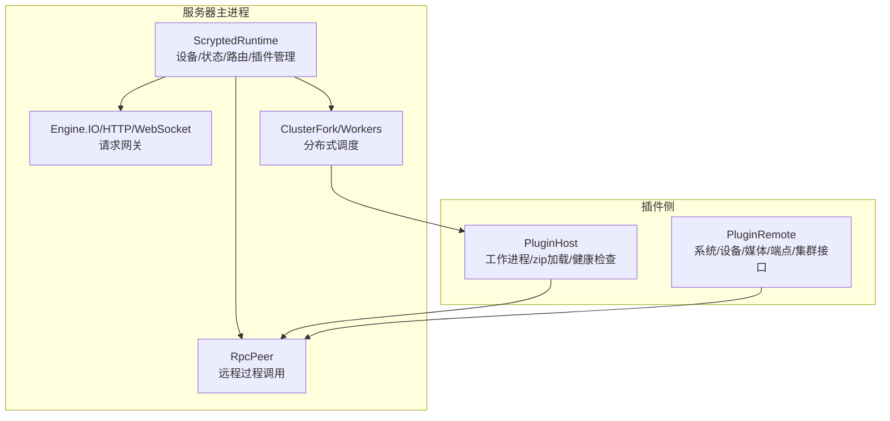
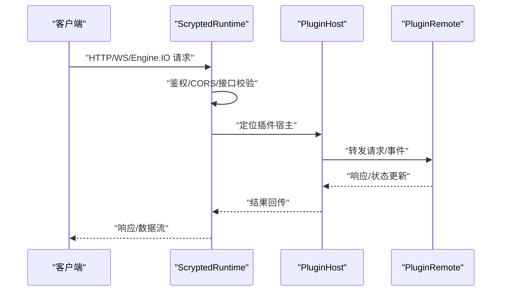
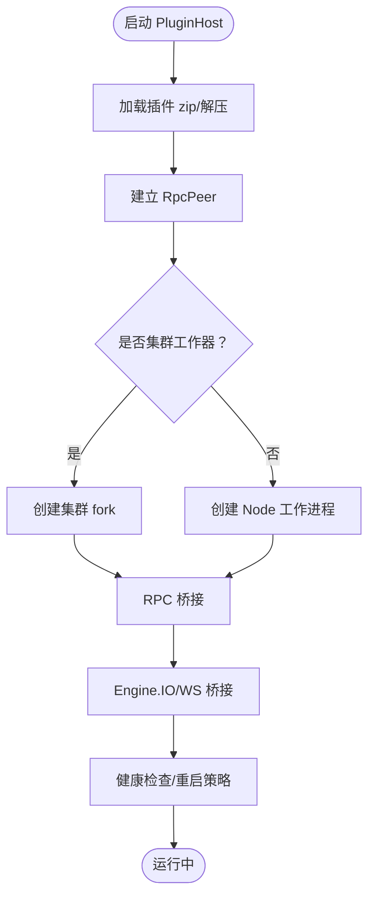
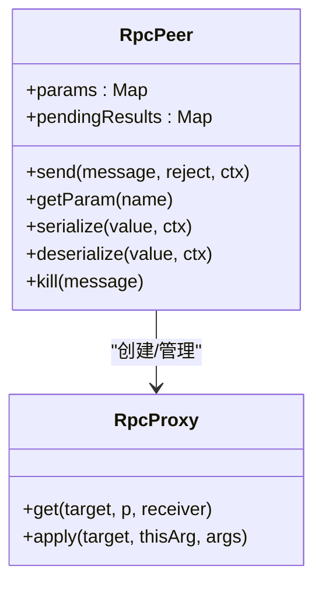
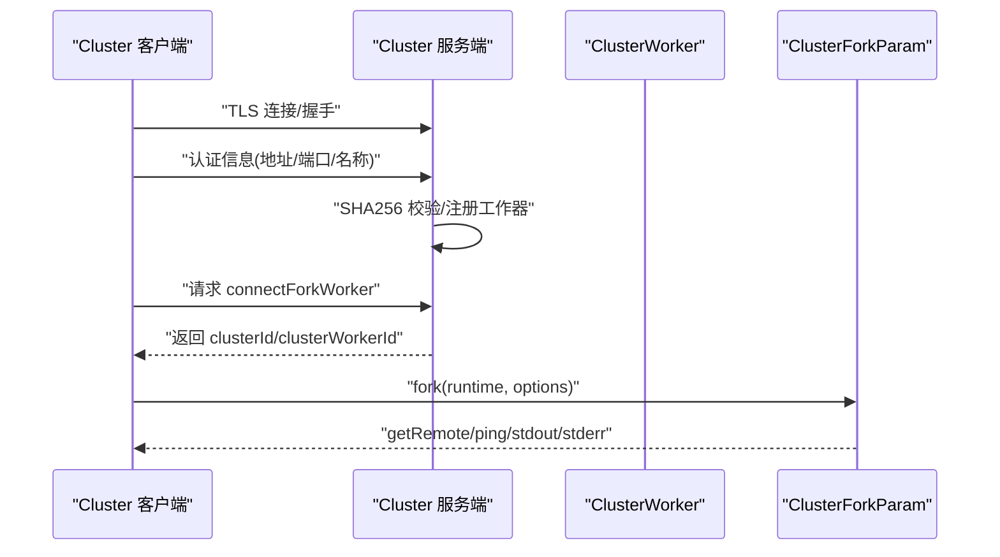
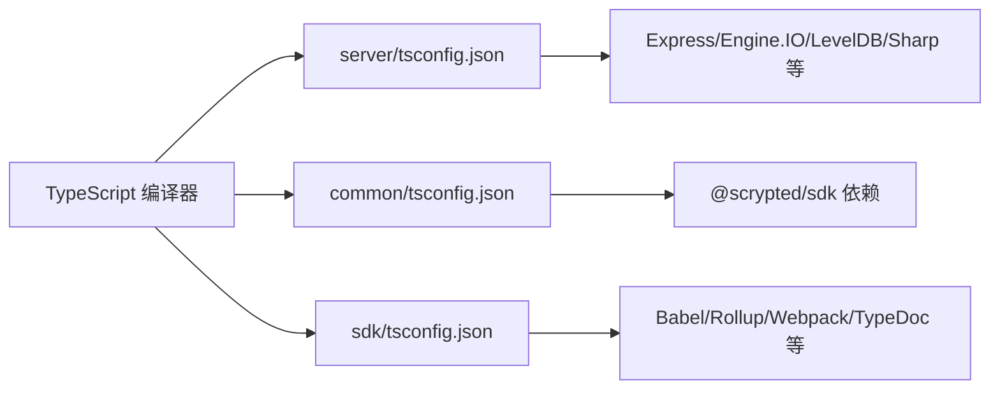

# 技术架构概述

<cite>
**本文档引用的文件**
- [README.md](file://README.md)
- [scrypted-main.ts](file://server/src/scrypted-main.ts)
- [plugin-host.ts](file://server/src/plugin/plugin-host.ts)
- [rpc.ts](file://server/src/rpc.ts)
- [scrypted-cluster-main.ts](file://server/src/scrypted-cluster-main.ts)
- [runtime.ts](file://server/src/runtime.ts)
- [plugin-remote.ts](file://server/src/plugin/plugin-remote.ts)
- [main.ts](file://plugins/core/src/main.ts)
- [index.ts](file://packages/rpc/src/index.ts)
- [rpc.ts（packages/rpc）](file://packages/rpc/src/rpc.ts)
- [tsconfig.json（server）](file://server/tsconfig.json)
- [tsconfig.json（common）](file://common/tsconfig.json)
- [tsconfig.json（sdk）](file://sdk/tsconfig.json)
- [package.json（server）](file://server/package.json)
- [package.json（sdk）](file://sdk/package.json)
- [package.json（common）](file://common/package.json)
</cite>

## 目录
1. [引言](#引言)
2. [项目结构](#项目结构)
3. [核心组件](#核心组件)
4. [架构总览](#架构总览)
5. [详细组件分析](#详细组件分析)
6. [依赖关系分析](#依赖关系分析)
7. [性能考虑](#性能考虑)
8. [故障排除指南](#故障排除指南)
9. [结论](#结论)

## 引言
本文件面向开发者与架构师，系统性阐述 Scrypted 的技术架构与实现原理。Scrypted 是一个基于 Node.js 与 TypeScript 的高性能家庭视频集成平台与 NVR，支持多品牌摄像头接入、智能检测与多生态（HomeKit、Google Home、Alexa）联动。其核心特征包括：
- 模块化插件架构：通过插件隔离设备厂商差异，统一对外提供设备能力。
- 高效 RPC 通信：在主进程与插件之间建立类型安全、序列化的远程调用通道。
- 分布式集群：支持跨主机的插件工作器（Worker）调度与负载均衡。
- 可扩展性：通过运行时抽象与插件机制，实现对新设备与新协议的快速扩展。

## 项目结构
仓库采用多包（monorepo）组织方式，主要目录与职责如下：
- server：Scrypted 服务器主进程，负责设备生命周期管理、HTTP/WebSocket/Engine.IO 网关、RPC 通信、插件托管与集群管理。
- plugins：官方插件集合，覆盖主流摄像头品牌与协议（如 ONVIF、RTSP、Google Home、HomeKit 等）。
- sdk：插件开发 SDK，提供类型定义、工具函数与打包脚手架。
- common：通用工具库，包含媒体处理、网络辅助、序列化等基础能力。
- packages：独立的可复用包，如 rpc、cli、client 等。
- install：容器与系统安装脚本，涵盖 Docker、Proxmox、本地安装等场景。
- sites/static：静态前端资源（如 Chromecast 接收端、Google Home Local SDK 应用等）。

**图示来源**
- [scrypted-main.ts:1-4](file://server/src/scrypted-main.ts#L1-L4)
- [runtime.ts:64-100](file://server/src/runtime.ts#L64-L100)
- [scrypted-cluster-main.ts:32-43](file://server/src/scrypted-cluster-main.ts#L32-L43)
- [rpc.ts:29-80](file://server/src/rpc.ts#L29-L80)
- [plugin-host.ts:38-50](file://server/src/plugin/plugin-host.ts#L38-L50)
- [plugin-remote.ts:13-23](file://server/src/plugin/plugin-remote.ts#L13-L23)
- [main.ts:27-40](file://plugins/core/src/main.ts#L27-L40)
- [index.ts:1-4](file://packages/rpc/src/index.ts#L1-L4)

**章节来源**
- [README.md:1-59](file://README.md#L1-L59)
- [package.json（server）:1-73](file://server/package.json#L1-L73)
- [package.json（sdk）:1-62](file://sdk/package.json#L1-L62)
- [package.json（common）:1-25](file://common/package.json#L1-L25)

## 核心组件
- 服务器主进程（ScryptedRuntime）
  - 负责设备发现、状态管理、HTTP/WebSocket/Engine.IO 请求路由、插件生命周期与自动重启、集群连接与工作器管理。
  - 提供系统级组件（服务控制、备份、用户、CORS、地址设置、告警等）的访问接口。
- 插件宿主（PluginHost）
  - 为每个插件创建独立的工作进程或集群工作器，建立 RPC Peer 并加载插件代码（zip 包解压与按需读取）。
  - 维护插件设备映射、IO/WebSocket 连接桥接、健康检查与自动重启。
- RPC 通信（RpcPeer）
  - 实现跨进程/跨节点的远程过程调用，支持对象代理、错误序列化、异步迭代器、弱引用回收与参数获取。
  - 提供缓冲区序列化、WebSocket 序列化等扩展点。
- 集群管理（ClusterFork/ClusterWorker）
  - 支持客户端/服务端模式的 TLS 连接，认证与哈希校验，动态 fork 新的工作器并分发任务。
  - 提供权重与标签（labels）的调度策略，便于按硬件能力或用途进行分配。
- 插件远程接口（PluginRemote）
  - 在插件侧暴露系统管理、设备管理、端点管理、媒体管理、集群管理等 API，并进行访问控制与事件过滤。
- 核心插件（@scrypted/core）
  - 提供系统设备（集群管理、媒体核心、脚本、终端、REPL、控制台、自动化、设备聚合、用户等），并负责更新与工作器管理。

**章节来源**
- [runtime.ts:64-100](file://server/src/runtime.ts#L64-L100)
- [plugin-host.ts:38-50](file://server/src/plugin/plugin-host.ts#L38-L50)
- [rpc.ts:285-400](file://server/src/rpc.ts#L285-L400)
- [scrypted-cluster-main.ts:72-130](file://server/src/scrypted-cluster-main.ts#L72-L130)
- [plugin-remote.ts:13-23](file://server/src/plugin/plugin-remote.ts#L13-L23)
- [main.ts:27-40](file://plugins/core/src/main.ts#L27-L40)

## 架构总览
Scrypted 的整体架构由“服务器主进程 + 插件宿主 + RPC 通信 + 集群管理”构成，形成“主进程集中编排、插件隔离执行、RPC 类型安全调用、集群弹性扩展”的设计。

**图示来源**
- [runtime.ts:64-100](file://server/src/runtime.ts#L64-L100)
- [plugin-host.ts:38-50](file://server/src/plugin/plugin-host.ts#L38-L50)
- [rpc.ts:285-400](file://server/src/rpc.ts#L285-L400)
- [scrypted-cluster-main.ts:131-211](file://server/src/scrypted-cluster-main.ts#L131-L211)
- [plugin-remote.ts:122-180](file://server/src/plugin/plugin-remote.ts#L122-L180)

## 详细组件分析

### 服务器主进程（ScryptedRuntime）
- 设备与状态管理
  - 维护设备代理与混入表（mixin），支持设备属性变更与混入链重建。
  - 提供系统状态查询与事件通知，确保插件侧可见性与一致性。
- 请求路由与安全
  - 支持 Engine.IO、HTTP、WebSocket 三种接入路径；统一处理 CORS、鉴权与访问控制。
  - 对升级请求进行严格接口校验（如 EngineIOHandler、HttpRequestHandler）。
- 插件生命周期
  - 安装/卸载/重装插件，自动探测依赖并按需安装；异常退出后定时重启。
  - 插件设备发现与混入失效清理，避免状态不一致。
- 集群连接
  - 启动 TLS 客户端/服务端，完成认证与握手，注册工作器并暴露 fork 能力。

**图示来源**
- [runtime.ts:397-464](file://server/src/runtime.ts#L397-L464)
- [plugin-host.ts:465-504](file://server/src/plugin/plugin-host.ts#L465-L504)
- [plugin-remote.ts:196-273](file://server/src/plugin/plugin-remote.ts#L196-L273)

**章节来源**
- [runtime.ts:64-100](file://server/src/runtime.ts#L64-L100)
- [runtime.ts:338-369](file://server/src/runtime.ts#L338-L369)
- [runtime.ts:691-720](file://server/src/runtime.ts#L691-L720)

### 插件宿主（PluginHost）
- 工作进程与运行时
  - 支持内置运行时（如 Node）与自定义运行时；根据插件声明与集群标签选择 fork 或普通工作进程。
  - 通过 zip 文件或 base64 内容加载插件代码，解压到插件卷并建立 RPC Peer。
- IO/WebSocket 桥接
  - Engine.IO 与 WebSocket 连接桥接到插件侧的 EngineIOHandler/StreamService，实现双向消息与关闭事件。
- 健康检查与自动重启
  - 定期 ping 插件，超时或异常则触发重启；调试模式下等待断点。
- 控制台与日志
  - 将插件标准输出/错误重定向至控制台服务，便于调试。

**图示来源**
- [plugin-host.ts:330-463](file://server/src/plugin/plugin-host.ts#L330-L463)
- [plugin-host.ts:465-504](file://server/src/plugin/plugin-host.ts#L465-L504)

**章节来源**
- [plugin-host.ts:38-50](file://server/src/plugin/plugin-host.ts#L38-L50)
- [plugin-host.ts:226-274](file://server/src/plugin/plugin-host.ts#L226-L274)
- [plugin-host.ts:276-328](file://server/src/plugin/plugin-host.ts#L276-L328)

### RPC 通信（RpcPeer）
- 对象代理与序列化
  - 自动将本地对象转换为远程代理，支持方法调用、属性访问与错误传播；对 Buffer、WebSocket 等类型提供专用序列化器。
- 异步迭代与弱引用回收
  - 支持 async iterator 的 next/throw/return；使用 FinalizationRegistry 与 WeakRef 回收远程代理。
- 参数与错误处理
  - 支持参数获取（getParam）、单向方法（oneway）与错误对象序列化，保证跨边界异常可传递。
- 性能与内存
  - 提供周期性 GC 触发与冻结 pending 结果集以防止泄漏。

**图示来源**
- [rpc.ts:285-400](file://server/src/rpc.ts#L285-L400)
- [rpc.ts:84-151](file://server/src/rpc.ts#L84-L151)
- [rpc.ts（packages/rpc）:285-400](file://packages/rpc/src/rpc.ts#L285-L400)

**章节来源**
- [rpc.ts:29-80](file://server/src/rpc.ts#L29-L80)
- [rpc.ts:570-678](file://server/src/rpc.ts#L570-L678)
- [rpc.ts:714-800](file://server/src/rpc.ts#L714-L800)

### 集群管理（ClusterFork/ClusterWorker）
- 认证与连接
  - 使用 TLS 与 SHA256 哈希进行客户端/服务端双向认证；支持环境变量覆盖地址与信任策略。
- 工作器注册与调度
  - 工作器携带标签（labels）与权重（weight），主进程据此进行任务分发与负载均衡。
- fork 机制
  - 通过 getRemote 获取插件侧远程接口，建立工作进程与 RPC Peer，支持超时与生命周期管理。

**图示来源**
- [scrypted-cluster-main.ts:213-330](file://server/src/scrypted-cluster-main.ts#L213-L330)
- [scrypted-cluster-main.ts:332-410](file://server/src/scrypted-cluster-main.ts#L332-L410)
- [scrypted-cluster-main.ts:131-211](file://server/src/scrypted-cluster-main.ts#L131-L211)

**章节来源**
- [scrypted-cluster-main.ts:72-130](file://server/src/scrypted-cluster-main.ts#L72-L130)
- [scrypted-cluster-main.ts:213-330](file://server/src/scrypted-cluster-main.ts#L213-L330)

### 插件远程接口（PluginRemote）
- 接口暴露
  - 在插件侧提供 SystemManager、DeviceManager、EndpointManager、MediaManager、ClusterManager 等能力。
  - 支持 WebSocket 连接、IO 事件、设备状态更新与系统状态同步。
- 访问控制与事件过滤
  - 根据 ACL 对设备属性、接口与事件进行过滤，保障隐私与权限控制。
- 生命周期管理
  - 通过 onGetRemote/onLoadZip 钩子注入自定义逻辑，如媒体管理创建、服务端口获取等。

**章节来源**
- [plugin-remote.ts:13-23](file://server/src/plugin/plugin-remote.ts#L13-L23)
- [plugin-remote.ts:109-180](file://server/src/plugin/plugin-remote.ts#L109-L180)
- [plugin-remote.ts:182-315](file://server/src/plugin/plugin-remote.ts#L182-L315)

### 核心插件（@scrypted/core）
- 系统设备与服务
  - 提供集群管理、媒体核心、脚本、终端、REPL、控制台、自动化、设备聚合、用户等系统设备。
- 更新与工作器管理
  - 定时检查工作器状态与镜像版本，必要时触发重启以应用更新。
- 设置与发布渠道
  - 提供本地地址、发布渠道等设置项，支持不同硬件平台的镜像标签。

**章节来源**
- [main.ts:27-40](file://plugins/core/src/main.ts#L27-L40)
- [main.ts:228-280](file://plugins/core/src/main.ts#L228-L280)
- [main.ts:282-294](file://plugins/core/src/main.ts#L282-L294)

## 依赖关系分析
- 语言与构建
  - 服务器与通用库使用 esnext + NodeNext/Node16 模块解析，启用 sourceMap 与严格类型检查。
  - SDK 使用 commonjs + ES2020，配合 Rollup/Webpack 打包与发布。
- 运行时依赖
  - 服务器依赖 Express、Engine.IO、WebSocket、LevelDB、Sharp、AdmZip、Tar 等，用于 Web 服务、媒体处理与包管理。
  - SDK 依赖 Babel、Rollup、Webpack、TypeDoc 等工具链，支撑多目标构建与文档生成。
- 插件生态
  - 插件通过 @scrypted/sdk 开发，依赖 @scrypted/types 提供的设备接口与类型约束，确保跨插件一致性。

**图示来源**
- [tsconfig.json（server）:1-18](file://server/tsconfig.json#L1-L18)
- [tsconfig.json（common）:1-17](file://common/tsconfig.json#L1-L17)
- [tsconfig.json（sdk）:1-15](file://sdk/tsconfig.json#L1-L15)
- [package.json（server）:5-32](file://server/package.json#L5-L32)
- [package.json（sdk）:31-54](file://sdk/package.json#L31-L54)
- [package.json（common）:13-18](file://common/package.json#L13-L18)

**章节来源**
- [tsconfig.json（server）:1-18](file://server/tsconfig.json#L1-L18)
- [tsconfig.json（common）:1-17](file://common/tsconfig.json#L1-L17)
- [tsconfig.json（sdk）:1-15](file://sdk/tsconfig.json#L1-L15)
- [package.json（server）:5-32](file://server/package.json#L5-L32)
- [package.json（sdk）:31-54](file://sdk/package.json#L31-L54)
- [package.json（common）:13-18](file://common/package.json#L13-L18)

## 性能考虑
- RPC 序列化优化
  - 仅对非传输安全类型进行代理包装与序列化，减少 JSON 负载；Buffer/自定义类型使用专用序列化器。
- 内存与垃圾回收
  - 通过弱引用与 FinalizationRegistry 回收远程代理，避免内存泄漏；周期性触发 GC 降低长期运行风险。
- 异步迭代与流式处理
  - 支持 async iterator 与流式数据（如 stdout/stderr），结合 oneway 方法降低往返开销。
- 集群调度
  - 基于标签与权重的调度策略，结合 TLS 与认证，确保跨主机任务分发的安全与高效。

[本节为通用指导，无需特定文件引用]

## 故障排除指南
- 插件无法启动或频繁重启
  - 检查插件 zip 加载日志与控制台输出；确认运行时声明与标签配置；查看健康检查失败原因。
- RPC 调用异常或超时
  - 关注 RpcPeer 的 pendingResults 冻结与错误序列化；确认序列化上下文与参数类型；排查 oneway 方法误用。
- 集群连接失败
  - 核对 SCRYPTED_CLUSTER_ADDRESS 与证书配置；验证 SHA256 哈希与地址/端口匹配；检查 keep-alive 与防火墙策略。
- 权限与事件过滤问题
  - 检查 AccessControls 的接口/属性/事件拒绝规则；确认系统状态同步与设备删除事件的处理。

**章节来源**
- [plugin-host.ts:307-325](file://server/src/plugin/plugin-host.ts#L307-L325)
- [rpc.ts:439-456](file://server/src/rpc.ts#L439-L456)
- [scrypted-cluster-main.ts:274-277](file://server/src/scrypted-cluster-main.ts#L274-L277)
- [plugin-remote.ts:26-59](file://server/src/plugin/plugin-remote.ts#L26-L59)

## 结论
Scrypted 通过“服务器主进程 + 插件宿主 + RPC 通信 + 集群管理”的架构，实现了高内聚、低耦合的设备生态体系。Node.js 与 TypeScript 的技术选型提供了强类型与良好生态支持；模块化插件与 RPC 代理机制确保了扩展性与安全性；集群能力进一步提升了可扩展性与可用性。该架构在性能、稳定性与可维护性之间取得平衡，适合构建大规模、多协议、多生态的家庭视频与智能设备平台。