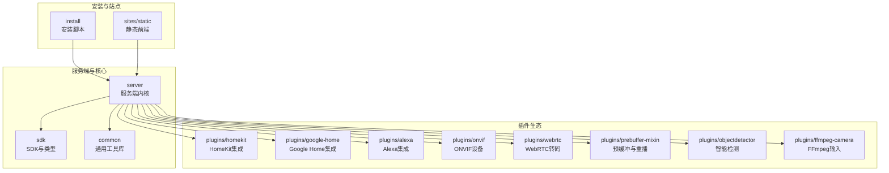
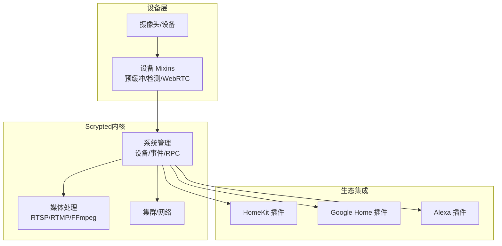
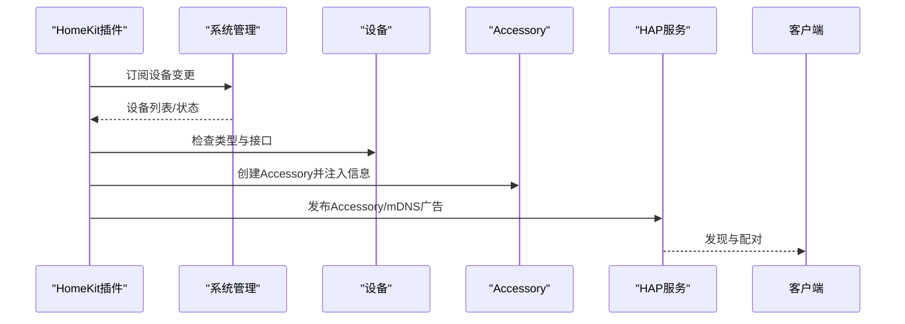
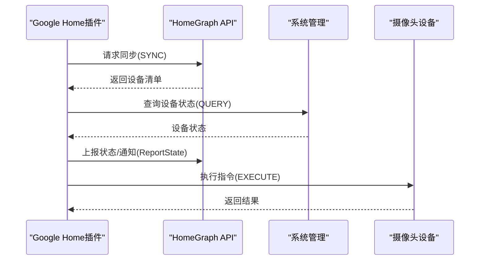
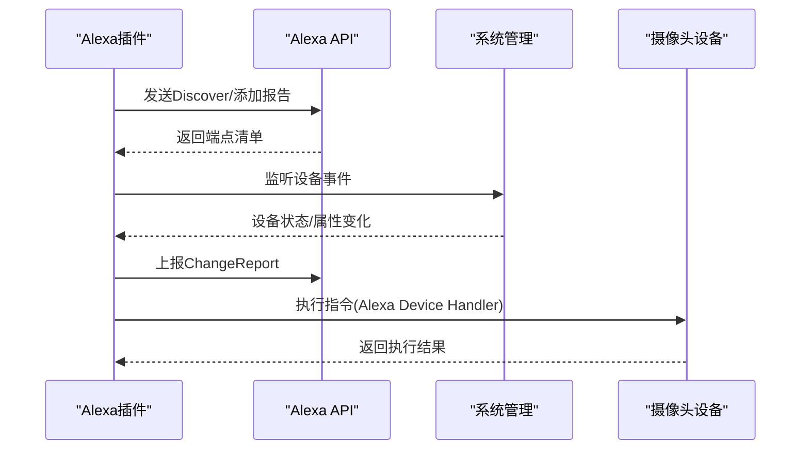
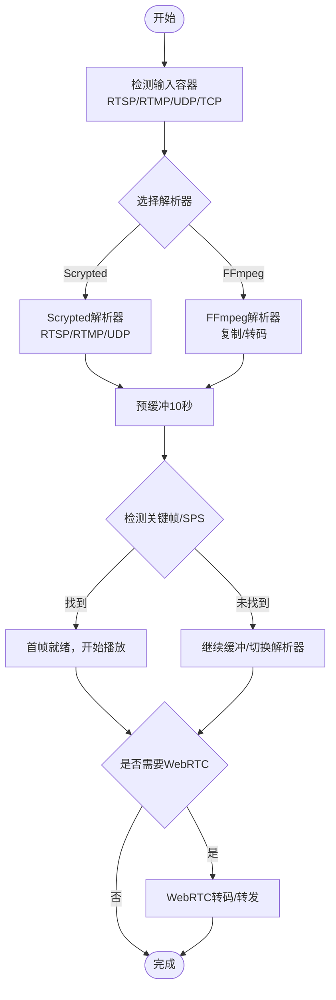
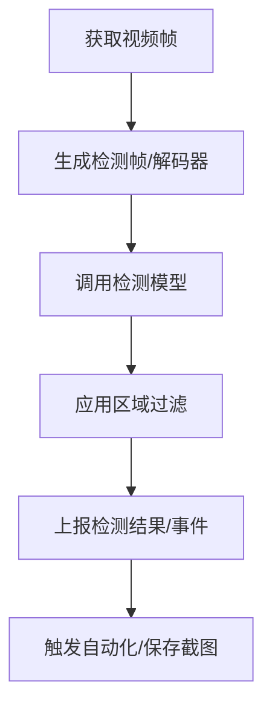
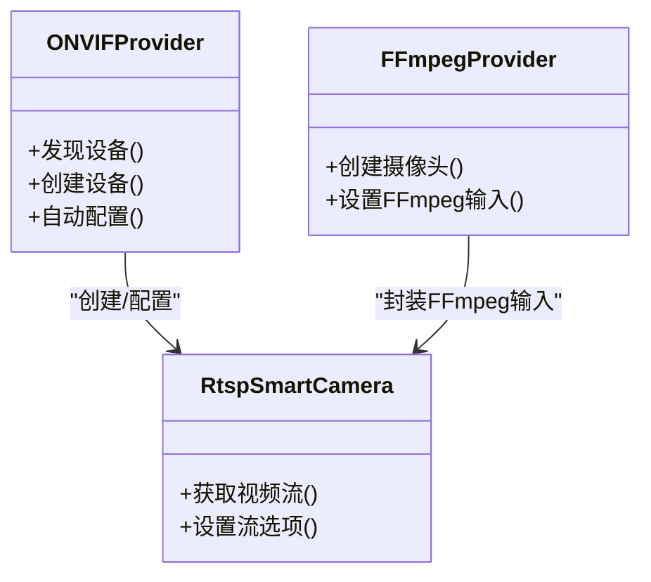
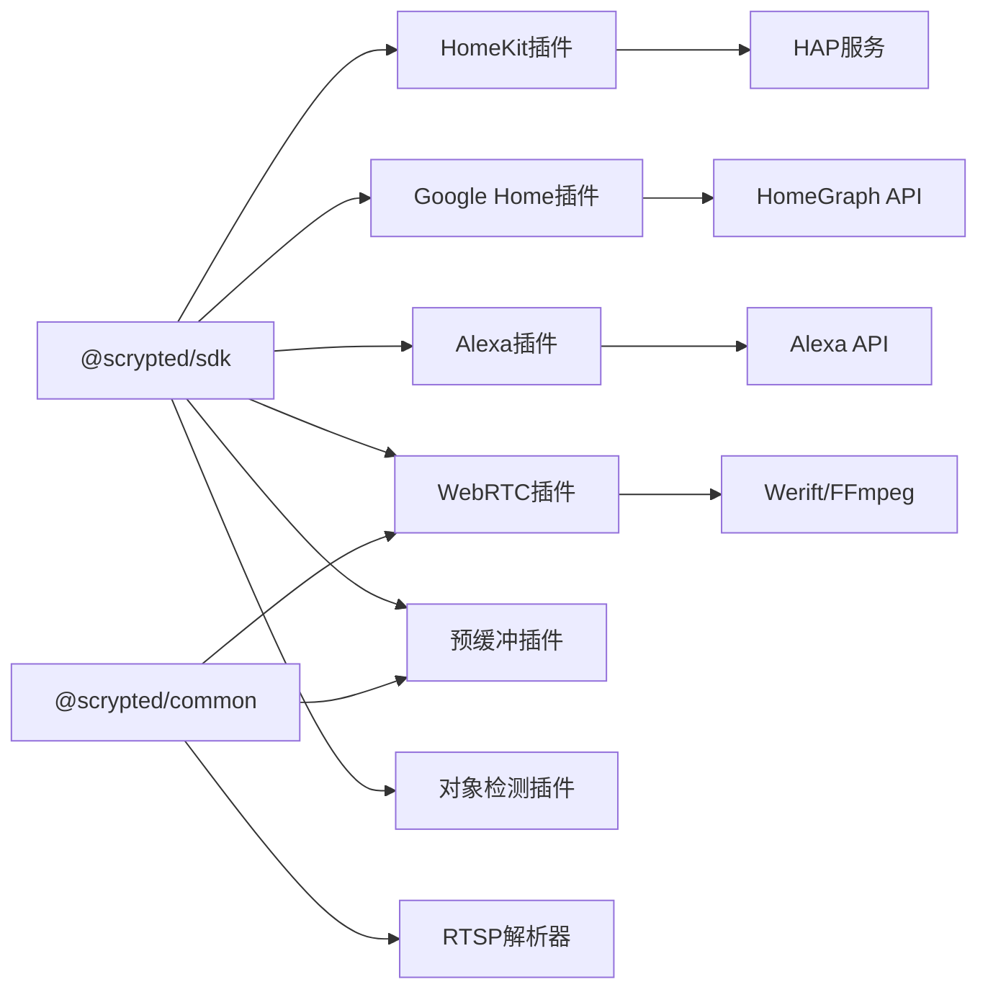

# 核心特性概览

<cite>
**本文档引用的文件**
- [README.md](file://README.md)
- [homekit/main.ts](file://plugins/homekit/src/main.ts)
- [google-home/main.ts](file://plugins/google-home/src/main.ts)
- [alexa/main.ts](file://plugins/alexa/src/main.ts)
- [objectdetector/main.ts](file://plugins/objectdetector/src/main.ts)
- [prebuffer-mixin/main.ts](file://plugins/prebuffer-mixin/src/main.ts)
- [webrtc/main.ts](file://plugins/webrtc/src/main.ts)
- [media-helpers.ts](file://server/src/media-helpers.ts)
- [rtsp-server.ts](file://common/src/rtsp-server.ts)
- [onvif/main.ts](file://plugins/onvif/src/main.ts)
- [ffmpeg-camera/main.ts](file://plugins/ffmpeg-camera/src/main.ts)
</cite>

## 目录
1. [简介](#简介)
2. [项目结构](#项目结构)
3. [核心组件](#核心组件)
4. [架构总览](#架构总览)
5. [详细组件分析](#详细组件分析)
6. [依赖关系分析](#依赖关系分析)
7. [性能考量](#性能考量)
8. [故障排除指南](#故障排除指南)
9. [结论](#结论)

## 简介
Scrypted 是一个高性能的家庭视频集成平台与 NVR，具备智能检测能力，并可向 HomeKit、Google Home、Alexa 等生态提供即时、低延迟的视频流与控制体验。它支持大多数摄像头，通过统一的设备模型与插件化架构实现跨平台、跨协议的设备接入与管理。

- 支持范围覆盖：主流品牌与协议（如 ONVIF、RTSP、RTMP、WebRTC），并通过插件扩展持续扩大兼容面。
- 集成生态：与 Apple HomeKit、Google Assistant、Amazon Alexa 深度集成，实现语音与 App 控制。
- 实时处理：内置预缓冲、RTSP/RTMP 解析、WebRTC 转码与转发，确保低延迟与高可用。
- 智能检测：基于对象检测的运动与事件识别，支持区域过滤与阈值配置。
- 设备管理：统一设备生命周期管理、自动发现与配置、混合器（Mixin）模式提升可组合性。

本节为概览性介绍，不直接分析具体源码文件。

## 项目结构
Scrypted 采用模块化的多包结构，核心由服务端内核、SDK、通用工具库与大量插件组成。关键目录与职责如下：
- server：Scrypted 服务端内核，负责设备管理、RPC、媒体处理与集群通信。
- sdk：对外 SDK 与类型定义，供插件开发使用。
- common：通用工具与媒体处理基础设施（如 RTSP 解析、流解析、辅助函数）。
- plugins：各类生态集成与设备接入插件（HomeKit、Google Home、Alexa、ONVIF、WebRTC、FFmpeg 等）。
- install：容器与系统安装脚本，支持 Docker、Proxmox 等部署方式。
- sites/static：静态前端资源（如 Chromecast 接收端、Google Home 本地 SDK 应用）。

图示来源
- [README.md:1-59](file://README.md#L1-L59)

章节来源
- [README.md:1-59](file://README.md#L1-L59)

## 核心组件
- 服务端内核（server）：提供设备系统状态、事件总线、RPC 通道、媒体转换与集群管理。
- SDK（sdk）：定义设备接口、类型与 Mixin 模式，统一插件开发规范。
- 通用工具（common）：包含 RTSP/RTMP 解析、流解析、SDP 处理、NPU/硬件加速辅助等。
- 生态集成插件：HomeKit、Google Home、Alexa 插件分别对接各平台的认证、同步与控制协议。
- 媒体处理插件：WebRTC 转码与转发、预缓冲与重播、智能检测、ONVIF 设备接入、FFmpeg 输入适配。

章节来源
- [README.md:1-59](file://README.md#L1-L59)

## 架构总览
下图展示了 Scrypted 的整体架构：设备通过插件接入，服务端统一管理；生态插件负责与 HomeKit/Google Home/Alexa 的协议交互；媒体处理插件负责低延迟流与智能检测。

图示来源
- [homekit/main.ts:60-487](file://plugins/homekit/src/main.ts#L60-L487)
- [google-home/main.ts:48-650](file://plugins/google-home/src/main.ts#L48-L650)
- [alexa/main.ts:23-736](file://plugins/alexa/src/main.ts#L23-L736)
- [prebuffer-mixin/main.ts:1-800](file://plugins/prebuffer-mixin/src/main.ts#L1-L800)
- [webrtc/main.ts:202-776](file://plugins/webrtc/src/main.ts#L202-L776)
- [objectdetector/main.ts:50-800](file://plugins/objectdetector/src/main.ts#L50-L800)

## 详细组件分析

### HomeKit 集成（无缝桥接与设备发布）
- 自动混入与设备发布：根据设备类型与接口自动启用 HomeKit 混合器，生成 Accessory 并发布到 mDNS，支持独立设备或桥接模式。
- 连接与广告：支持多种 mDNS 广告器（Ciao/Bonjour/Avahi），可按地址或接口绑定，便于局域网发现。
- 安全与配对：使用 HAP 存储与随机端口，支持慢速连接地址白名单，自动记录 Home Hub 地址以优化远程流质量。
- 类型映射与信息：将 Scrypted 设备类型映射到 HomeKit Category，附加设备信息与电池状态服务。

图示来源
- [homekit/main.ts:187-408](file://plugins/homekit/src/main.ts#L187-L408)

章节来源
- [homekit/main.ts:60-487](file://plugins/homekit/src/main.ts#L60-L487)

### Google Home 集成（双向同步与本地控制）
- 同步与查询：支持设备同步（SYNC）、状态查询（QUERY）、执行命令（EXECUTE）与断开（DISCONNECT）。
- 本地授权与信令：通过本地端点与 mDNS 服务暴露，支持浏览器 RTCC 信令，保障低延迟本地观看。
- 状态上报与请求同步：周期性上报状态，支持批量通知；当设备描述变化时触发请求同步。
- JWT 与云桥：优先使用本地 JWT，否则通过 Scrypted Cloud 桥接上报与请求同步。

图示来源
- [google-home/main.ts:266-420](file://plugins/google-home/src/main.ts#L266-L420)

章节来源
- [google-home/main.ts:48-650](file://plugins/google-home/src/main.ts#L48-L650)

### Alexa 集成（设备发现与事件上报）
- 自动混入与发现：根据设备类型自动启用 Alexa 混合器，支持设备发现（Discover）与增量更新。
- 令牌与端点：动态获取 Alexa API 端点，维护访问令牌，处理过期与重新认证。
- 事件上报：监听设备事件，按需发送 ChangeReport，支持在线/电池状态附加。
- 本地授权：通过 Scrypted Cloud 获取 cookie，校验用户身份后放行本地请求。

图示来源
- [alexa/main.ts:314-412](file://plugins/alexa/src/main.ts#L314-L412)

章节来源
- [alexa/main.ts:23-736](file://plugins/alexa/src/main.ts#L23-L736)

### 实时视频处理与低延迟传输
- 预缓冲与重播：在首次拉流时进行短时预缓冲，自动选择 Scrypted/FFmpeg 解析器，支持 RTSP/RTMP/UDP/TCP 等路径，按需启动与停止，降低空闲占用。
- RTSP/RTMP 解析：内置 RTSP 解析器，支持 H264/H265 关键帧检测、Nalu 类型解析与 SDP 提取，保证首帧可用与稳定播放。
- WebRTC 转码与转发：通过 Werift/FFmpeg 将媒体流转换为 WebRTC 可用格式，支持 STUN/TURN、兼容模式与数据通道 RPC，实现跨网络低延迟传输。
- 媒体助手：安全终止 FFmpeg 进程、打印初始日志、参数脱敏输出，便于问题排查。

图示来源
- [prebuffer-mixin/main.ts:460-720](file://plugins/prebuffer-mixin/src/main.ts#L460-L720)
- [rtsp-server.ts:279-333](file://common/src/rtsp-server.ts#L279-L333)
- [webrtc/main.ts:423-462](file://plugins/webrtc/src/main.ts#L423-L462)
- [media-helpers.ts:11-98](file://server/src/media-helpers.ts#L11-L98)

章节来源
- [prebuffer-mixin/main.ts:1-800](file://plugins/prebuffer-mixin/src/main.ts#L1-L800)
- [rtsp-server.ts:1-800](file://common/src/rtsp-server.ts#L1-L800)
- [webrtc/main.ts:202-776](file://plugins/webrtc/src/main.ts#L202-L776)
- [media-helpers.ts:1-98](file://server/src/media-helpers.ts#L1-L98)

### 智能检测与区域过滤
- 对象检测管线：将视频帧交给检测模型，支持运动检测与目标识别，结合区域过滤（包含/相交/排除）与置信度阈值。
- 性能监控：检测帧率采样与水位线控制，避免系统过载；长时间检测会发出警告提示优化。
- 区域编辑：支持多边形区域配置，区分包含/排除/观察模式，用于自动化触发与过滤误报。
- 内置运动传感器：可替换或辅助内置运动传感器，按需开启分析窗口。

图示来源
- [objectdetector/main.ts:325-537](file://plugins/objectdetector/src/main.ts#L325-L537)

章节来源
- [objectdetector/main.ts:50-800](file://plugins/objectdetector/src/main.ts#L50-L800)

### 设备统一管理与多平台兼容
- 设备发现与配置：ONVIF 插件支持设备发现、自动配置与能力探测，适配 PTZ、OSD、两路音频等特性。
- FFmpeg 输入适配：通过自定义 FFmpeg 输入参数，适配多种 RTMP/RTSP/流媒体协议，支持多路码流。
- 混合器模式：通过 Mixin 将生态集成、检测、转码等功能叠加到设备上，无需修改设备原生接口。

图示来源
- [onvif/main.ts:334-622](file://plugins/onvif/src/main.ts#L334-L622)
- [ffmpeg-camera/main.ts:144-155](file://plugins/ffmpeg-camera/src/main.ts#L144-L155)

章节来源
- [onvif/main.ts:1-622](file://plugins/onvif/src/main.ts#L1-L622)
- [ffmpeg-camera/main.ts:1-155](file://plugins/ffmpeg-camera/src/main.ts#L1-L155)

## 依赖关系分析
- 插件与内核：所有生态插件与媒体插件均通过 SDK 与服务端内核交互，遵循统一的设备接口与 Mixin 协议。
- 工具库复用：common 中的 RTSP/RTMP 解析、流解析、SDP 工具被多个插件共享，减少重复实现。
- 第三方库：HomeKit 使用 HAP，Google Home 使用 HomeGraph SDK，Alexa 使用 Amazon OAuth/REST，WebRTC 使用 Werift/FFmpeg。

图示来源
- [homekit/main.ts:1-50](file://plugins/homekit/src/main.ts#L1-L50)
- [google-home/main.ts:1-25](file://plugins/google-home/src/main.ts#L1-L25)
- [alexa/main.ts:1-15](file://plugins/alexa/src/main.ts#L1-L15)
- [webrtc/main.ts:1-25](file://plugins/webrtc/src/main.ts#L1-L25)
- [prebuffer-mixin/main.ts:1-25](file://plugins/prebuffer-mixin/src/main.ts#L1-L25)
- [rtsp-server.ts:1-25](file://common/src/rtsp-server.ts#L1-L25)

章节来源
- [homekit/main.ts:1-50](file://plugins/homekit/src/main.ts#L1-L50)
- [google-home/main.ts:1-25](file://plugins/google-home/src/main.ts#L1-L25)
- [alexa/main.ts:1-15](file://plugins/alexa/src/main.ts#L1-L15)
- [webrtc/main.ts:1-25](file://plugins/webrtc/src/main.ts#L1-L25)
- [prebuffer-mixin/main.ts:1-25](file://plugins/prebuffer-mixin/src/main.ts#L1-L25)
- [rtsp-server.ts:1-25](file://common/src/rtsp-server.ts#L1-L25)

## 性能考量
- 预缓冲策略：默认 10 秒预缓冲，结合关键帧检测与解析器选择，缩短首帧时间并提升稳定性。
- 解析器选择：在 Scrypted/FFmpeg 之间动态选择，UDP/TCP 间切换，适配不同网络环境与设备能力。
- 检测性能保护：检测帧率采样与阈值控制，避免系统过载；长时间检测会提示优化建议。
- FFmpeg 安全终止：提供安全终止流程，确保上游协议（如 RTSP TEARDOWN）得到响应，避免资源泄漏。
- WebRTC 兼容模式：在严格 NAT 或客户端兼容性不佳时启用最大兼容模式，牺牲部分性能换取稳定性。

本节为通用指导，不直接分析具体源码文件。

## 故障排除指南
- FFmpeg 日志与参数脱敏：通过安全日志输出与参数脱敏，帮助定位输入 URL、编码器参数等问题。
- RTSP 客户端错误：当收到非法帧魔法数或认证失败时，插件会抛出明确错误并建议切换解析器或协议。
- WebRTC 连接异常：可通过 ICE 服务器配置（STUN/TURN）与候选过滤（如 6to4 禁用）改善连接质量。
- 设备离线与重播：预缓冲会根据设备在线状态自动启停，若长时间无数据可能标记设备离线，检查网络与电源。

章节来源
- [media-helpers.ts:40-98](file://server/src/media-helpers.ts#L40-L98)
- [rtsp-server.ts:514-553](file://common/src/rtsp-server.ts#L514-L553)
- [webrtc/main.ts:650-712](file://plugins/webrtc/src/main.ts#L650-L712)

## 结论
Scrypted 通过统一的设备模型与插件化架构，实现了高性能视频集成、智能检测、低延迟流媒体传输与多平台无缝集成。其预缓冲与解析器选择机制、WebRTC 转码与兼容模式、对象检测与区域过滤、以及与 HomeKit/Google Home/Alexa 的深度集成，共同构成了强大的家庭视频中枢能力。对于用户而言，Scrypted 不仅能快速接入大多数摄像头，还能在不同生态中提供一致且低延迟的体验。