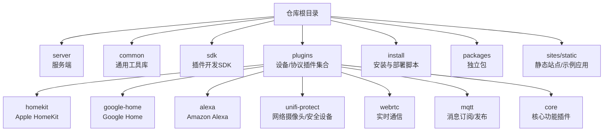
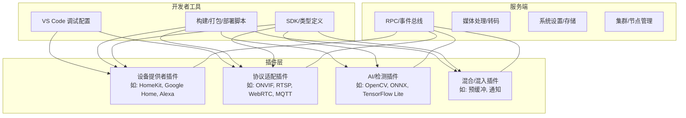
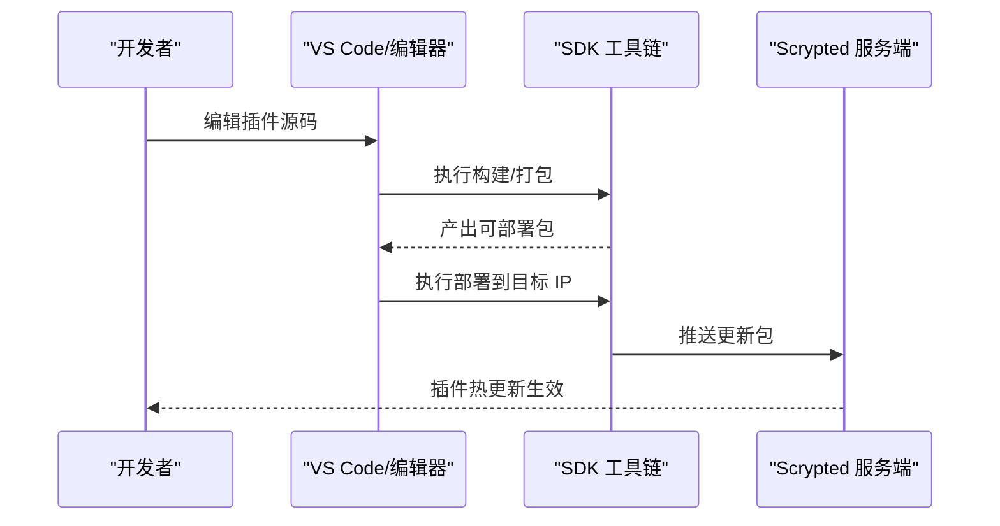
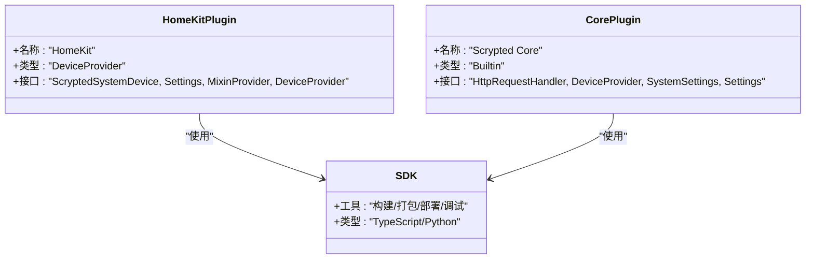
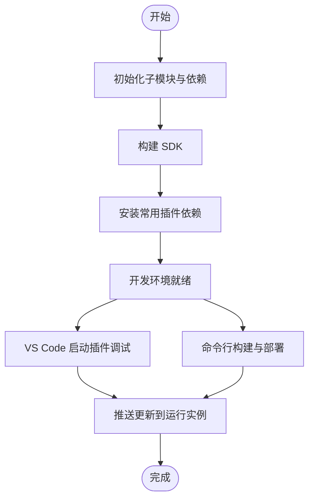
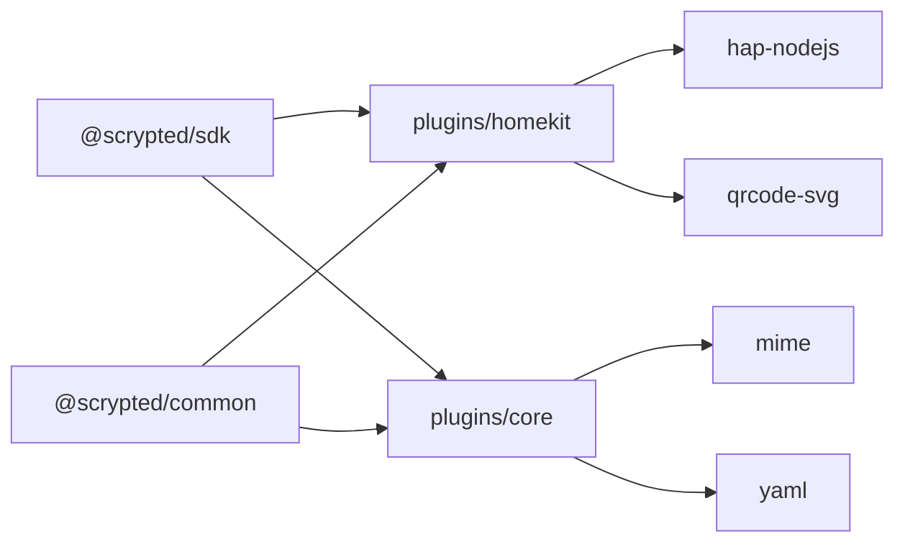

# 生态系统与社区

<cite>
**本文引用的文件**
- [README.md](file://README.md)
- [repository.yaml](file://repository.yaml)
- [.github/FUNDING.yml](file://.github/FUNDING.yml)
- [LICENSE.md](file://LICENSE.md)
- [sdk/README.md](file://sdk/README.md)
- [plugins/core/README.md](file://plugins/core/README.md)
- [sdk/package.json](file://sdk/package.json)
- [plugins/homekit/package.json](file://plugins/homekit/package.json)
- [plugins/core/package.json](file://plugins/core/package.json)
- [sdk/bin/scrypted-deploy.js](file://sdk/bin/scrypted-deploy.js)
- [sdk/bin/scrypted-setup-project.js](file://sdk/bin/scrypted-setup-project.js)
- [npm-install.sh](file://npm-install.sh)
- [.github/ISSUE_TEMPLATE/bug_report.md](file://.github/ISSUE_TEMPLATE/bug_report.md)
</cite>

## 目录
1. [简介](#简介)
2. [项目结构](#项目结构)
3. [核心组件](#核心组件)
4. [架构总览](#架构总览)
5. [详细组件分析](#详细组件分析)
6. [依赖关系分析](#依赖关系分析)
7. [性能考量](#性能考量)
8. [故障排查指南](#故障排查指南)
9. [结论](#结论)
10. [附录](#附录)

## 简介
本文件面向希望了解 Scrypted 开源生态与社区的读者，系统性介绍其插件化架构、100+ 设备集成插件、第三方支持与活跃社区，以及围绕 SDK、开发工具链、治理与贡献流程的实践路径。同时提供社区资源（Discord、Reddit、GitHub）、技术支持渠道与学习资源建议，帮助个人用户与开发者快速融入 Scrypted 的开源协作与技术创新氛围。

## 项目结构
Scrypted 采用多模块仓库组织方式：核心服务端（server）、通用工具库（common）、SDK（sdk）、大量插件（plugins）以及安装与部署相关脚本（install）。插件目录下包含众多设备与协议适配器，覆盖视频、智能门铃、门锁、传感器、自动化等场景；SDK 提供统一的开发工具链与打包发布能力；安装脚本与 Docker 配置便于在多种环境部署运行。

图表来源
- [README.md:1-59](file://README.md#L1-L59)
- [plugins/homekit/package.json:1-56](file://plugins/homekit/package.json#L1-L56)
- [plugins/core/package.json:1-51](file://plugins/core/package.json#L1-L51)

章节来源
- [README.md:1-59](file://README.md#L1-L59)
- [plugins/homekit/package.json:1-56](file://plugins/homekit/package.json#L1-L56)
- [plugins/core/package.json:1-51](file://plugins/core/package.json#L1-L51)

## 核心组件
- 核心插件（Core）：提供 UI、Websocket、Engine.IO 接口、系统设置与设备管理等基础能力，是 Scrypted 平台的“内置内核”。
- 插件生态：涵盖视频采集、协议对接（ONVIF、RTSP、WebRTC、MQTT、HomeKit、Google Device Access、Alexa 等）、AI 检测（OpenCV、ONNX、TensorFlow Lite、OpenVINO、NCNN、Core ML）、自动化与通知等。
- SDK 与工具链：提供统一的 TypeScript/Python 开发体验，内置构建、打包、调试与部署命令，简化插件开发与分发。
- 安装与部署：提供 Docker、Compose、Proxmox、本地安装脚本，覆盖桌面、服务器、NVR 等多种场景。

章节来源
- [plugins/core/README.md:1-4](file://plugins/core/README.md#L1-L4)
- [plugins/core/package.json:25-36](file://plugins/core/package.json#L25-L36)
- [sdk/README.md:1-1](file://sdk/README.md#L1-L1)
- [sdk/package.json:13-28](file://sdk/package.json#L13-L28)

## 架构总览
Scrypted 的整体架构由“服务端宿主 + 多插件”组成。服务端负责 RPC、事件、媒体处理与集群管理；插件以设备或协议适配器形式接入，通过 SDK 提供统一接口。开发者可基于 SDK 快速实现新插件，并通过工具链完成本地调试与远程部署。

图表来源
- [plugins/homekit/package.json:25-36](file://plugins/homekit/package.json#L25-L36)
- [plugins/core/package.json:25-36](file://plugins/core/package.json#L25-L36)
- [sdk/package.json:13-28](file://sdk/package.json#L13-L28)

## 详细组件分析

### 插件开发与 SDK 生态
- SDK 工具链：提供构建、打包、部署、调试等命令，支持 TypeScript/JavaScript 与 Python 插件开发。
- 插件模板与类型：通过 SDK 初始化项目，生成符合 Scrypted 规范的 tsconfig、package.json 与入口文件。
- 远程部署：通过部署脚本将本地修改即时推送到运行中的 Scrypted 实例，无需重启服务端。

图表来源
- [sdk/bin/scrypted-deploy.js:11-16](file://sdk/bin/scrypted-deploy.js#L11-L16)
- [sdk/bin/scrypted-setup-project.js:6-6](file://sdk/bin/scrypted-setup-project.js#L6-L6)
- [plugins/homekit/package.json:5-17](file://plugins/homekit/package.json#L5-L17)

章节来源
- [sdk/package.json:13-28](file://sdk/package.json#L13-L28)
- [sdk/bin/scrypted-deploy.js:1-21](file://sdk/bin/scrypted-deploy.js#L1-L21)
- [sdk/bin/scrypted-setup-project.js:1-7](file://sdk/bin/scrypted-setup-project.js#L1-L7)
- [plugins/homekit/package.json:5-17](file://plugins/homekit/package.json#L5-L17)

### 插件类型与典型用例
- 设备提供者插件：将外部设备或服务暴露为 Scrypted 可管理的设备对象，如 HomeKit、Google Device Access、Alexa。
- 协议适配插件：直接对接摄像头或设备协议，如 ONVIF、RTSP、WebRTC、MQTT。
- AI/检测插件：对视频流进行智能分析，如 OpenCV、ONNX、TensorFlow Lite、OpenVINO、NCNN、Core ML。
- 混合/混入插件：增强现有设备能力，如预缓冲、通知转发、截图生成等。

图表来源
- [plugins/homekit/package.json:25-36](file://plugins/homekit/package.json#L25-L36)
- [plugins/core/package.json:25-36](file://plugins/core/package.json#L25-L36)
- [sdk/package.json:13-28](file://sdk/package.json#L13-L28)

章节来源
- [plugins/homekit/package.json:25-36](file://plugins/homekit/package.json#L25-L36)
- [plugins/core/package.json:25-36](file://plugins/core/package.json#L25-L36)
- [sdk/package.json:13-28](file://sdk/package.json#L13-L28)

### 开发者工具链与本地调试
- 一键安装与构建：提供脚本自动初始化子模块、安装依赖并构建 SDK，便于快速搭建开发环境。
- VS Code 调试：通过 SDK 提供的调试命令，可在 VS Code 中直接启动插件或服务端进行断点调试。
- 命令行部署：无需 VS Code，也可通过命令行构建并部署到指定 IP 的 Scrypted 实例。

图表来源
- [npm-install.sh:9-28](file://npm-install.sh#L9-L28)
- [plugins/homekit/package.json:5-17](file://plugins/homekit/package.json#L5-L17)
- [sdk/bin/scrypted-deploy.js:11-16](file://sdk/bin/scrypted-deploy.js#L11-L16)

章节来源
- [npm-install.sh:1-37](file://npm-install.sh#L1-L37)
- [plugins/homekit/package.json:5-17](file://plugins/homekit/package.json#L5-L17)
- [sdk/bin/scrypted-deploy.js:1-21](file://sdk/bin/scrypted-deploy.js#L1-L21)

## 依赖关系分析
- 插件与 SDK：多数插件通过本地文件依赖 SDK 与 common 工具库，确保类型与工具的一致性。
- 插件间耦合：插件之间通过服务端 RPC 与事件总线交互，避免直接耦合，保持松耦合与高内聚。
- 第三方依赖：SDK 与部分插件引入外部库（如 WebRTC、MQTT、HomeKit 等），需遵循各自许可证要求。

图表来源
- [plugins/homekit/package.json:38-45](file://plugins/homekit/package.json#L38-L45)
- [plugins/core/package.json:38-46](file://plugins/core/package.json#L38-L46)
- [sdk/package.json:31-54](file://sdk/package.json#L31-L54)

章节来源
- [plugins/homekit/package.json:38-45](file://plugins/homekit/package.json#L38-L45)
- [plugins/core/package.json:38-46](file://plugins/core/package.json#L38-L46)
- [sdk/package.json:31-54](file://sdk/package.json#L31-L54)

## 性能考量
- 插件热更新：修改插件后无需重启服务端即可生效，提升迭代效率。
- 媒体处理与转码：服务端提供媒体处理能力，结合插件侧的硬件加速与编码优化，降低延迟与资源占用。
- 预缓冲与回放：部分插件提供预缓冲与回放能力，改善用户体验与事件触发响应速度。
- 集群与分布式：服务端具备集群能力，适合多节点部署与扩展。

## 故障排查指南
- 使用 GitHub Issues 前请先查看设备控制台日志，避免重复提问。
- Issues 不用于支持咨询、讨论或功能请求，请移步社区渠道。
- 若某功能曾正常但现异常，可提交 Issue 并附上日志与复现步骤。

章节来源
- [.github/ISSUE_TEMPLATE/bug_report.md:10-23](file://.github/ISSUE_TEMPLATE/bug_report.md#L10-L23)

## 结论
Scrypted 以插件化架构为核心，辅以完善的 SDK 与工具链，形成覆盖设备接入、协议适配、AI 检测与自动化等领域的丰富生态。社区通过 Discord、Reddit、GitHub 等平台保持活跃沟通，配合清晰的贡献与问题反馈流程，营造开放协作与持续创新的良好氛围。对于个人用户与开发者而言，均可在此生态中找到适合的起点与成长路径。

## 附录

### 社区资源与参与方式
- 社区平台：Discord、Reddit、GitHub Issues/ Discussions
- 维护者与资助：可通过 GitHub 资助维护者以支持项目发展
- 许可证：仓库内各子项目可能采用不同许可证，请以具体目录为准

章节来源
- [README.md:11-13](file://README.md#L11-L13)
- [.github/FUNDING.yml:1-4](file://.github/FUNDING.yml#L1-L4)
- [LICENSE.md:1-4](file://LICENSE.md#L1-L4)

### 学习资源与官方文档
- 官方开发者文档：https://developer.scrypted.app
- 项目主页与文档：https://docs.scrypted.app
- 插件示例与核心插件说明：见各插件目录下的 README

章节来源
- [README.md:39-42](file://README.md#L39-L42)
- [plugins/core/README.md:1-4](file://plugins/core/README.md#L1-L4)