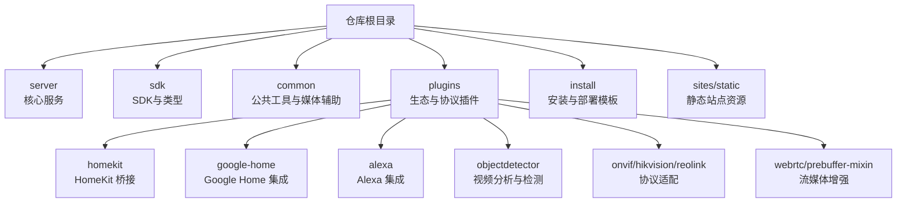
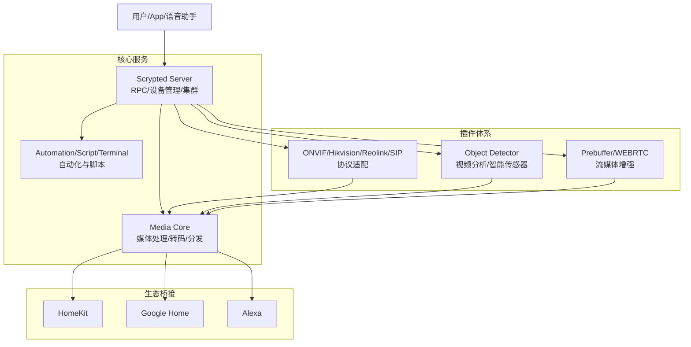
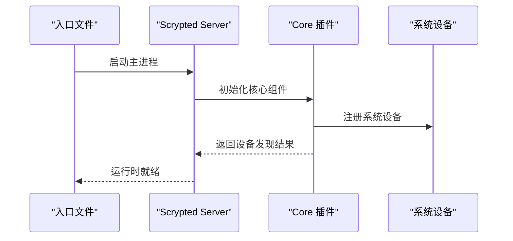
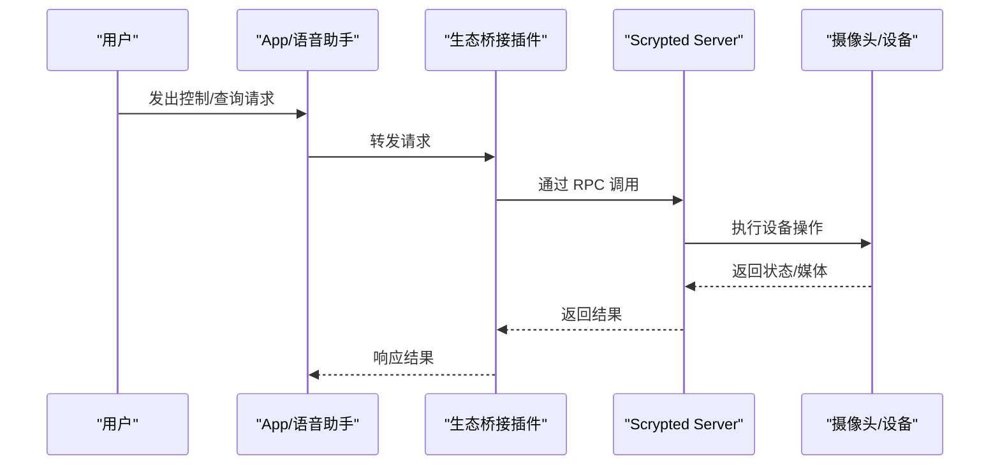
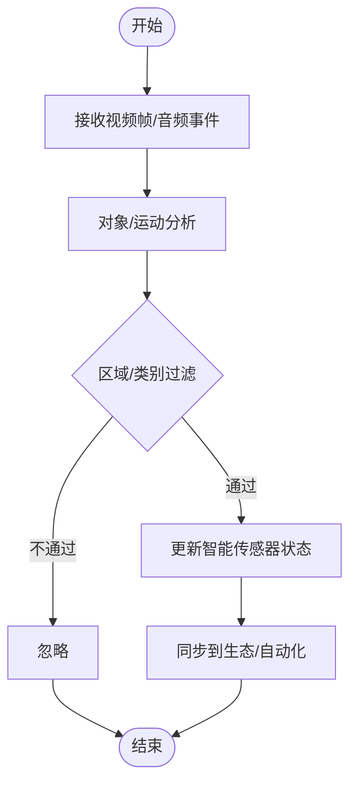
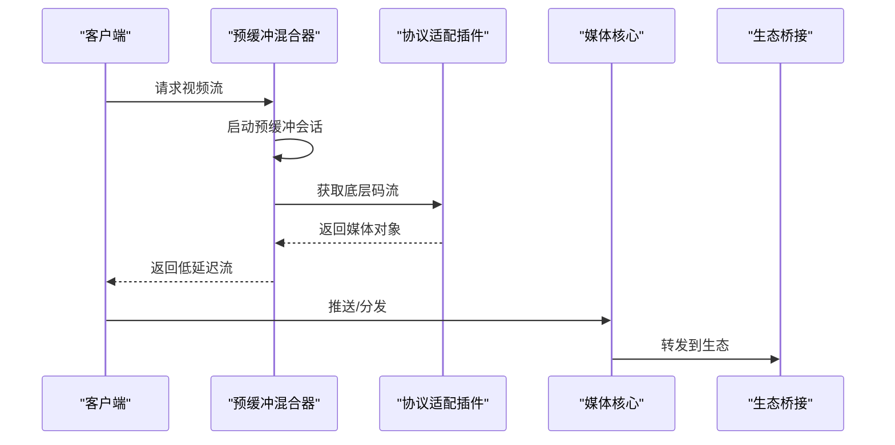
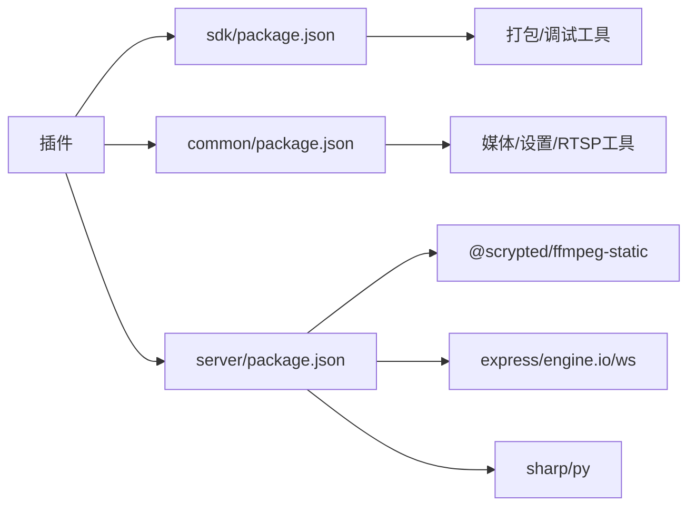

# 项目介绍与定位

<cite>
**本文引用的文件**
- [README.md](file://README.md)
- [repository.yaml](file://repository.yaml)
- [server/src/scrypted-main.ts](file://server/src/scrypted-main.ts)
- [plugins/core/src/main.ts](file://plugins/core/src/main.ts)
- [plugins/homekit/README.md](file://plugins/homekit/README.md)
- [plugins/google-home/README.md](file://plugins/google-home/README.md)
- [plugins/alexa/README.md](file://plugins/alexa/README.md)
- [plugins/objectdetector/README.md](file://plugins/objectdetector/README.md)
- [plugins/objectdetector/src/main.ts](file://plugins/objectdetector/src/main.ts)
- [plugins/prebuffer-mixin/src/main.ts](file://plugins/prebuffer-mixin/src/main.ts)
- [plugins/onvif/src/main.ts](file://plugins/onvif/src/main.ts)
- [plugins/hikvision/src/hikvision-camera-api.ts](file://plugins/hikvision/src/hikvision-camera-api.ts)
- [plugins/sip/src/main.ts](file://plugins/sip/src/main.ts)
- [install/docker/docker-compose.yml](file://install/docker/docker-compose.yml)
- [install/config.yaml](file://install/config.yaml)
- [server/package.json](file://server/package.json)
- [sdk/package.json](file://sdk/package.json)
- [common/package.json](file://common/package.json)
</cite>

## 目录
1. [引言](#引言)
2. [项目结构](#项目结构)
3. [核心组件](#核心组件)
4. [架构总览](#架构总览)
5. [详细组件分析](#详细组件分析)
6. [依赖关系分析](#依赖关系分析)
7. [性能考量](#性能考量)
8. [故障排查指南](#故障排查指南)
9. [结论](#结论)
10. [附录](#附录)

## 引言
Scrypted 是一个高性能的家庭视频集成平台与网络视频录像机（NVR），具备智能检测能力，并可向 HomeKit、Google Home、Alexa 等主流智能家居生态提供低延迟实时流媒体与控制服务。它通过统一的设备模型与插件化架构，将来自不同厂商的摄像头与设备接入同一平台，实现统一管理、自动化与跨生态联动。

Scrypted 的核心定位是“家庭视频中枢”，既可作为 NVR 录制与回放中心，也可作为智能视觉分析与自动化引擎，同时通过云桥接与本地直连的方式，打通多生态设备，满足从入门用户到专业用户的多样化需求。

## 项目结构
仓库采用多包（monorepo）组织方式，主要分为以下几类：
- 核心服务：server，负责运行时、RPC、集群、媒体处理等核心能力。
- SDK 与公共库：sdk、common，提供开发工具链、类型定义、通用工具与媒体辅助模块。
- 插件体系：plugins/*，覆盖 HomeKit、Google Home、Alexa、ONVIF、Hikvision、Reolink、WebRTC、对象检测等生态与协议适配。
- 安装与部署：install/*，提供 Docker Compose、Home Assistant Add-on、Proxmox 等部署模板与脚本。
- 站点资源：sites/static，包含 Chromecast、Google Home Local SDK 等前端应用资源。

下图展示项目顶层结构与关键目录的关系：

图表来源
- [server/src/scrypted-main.ts:1-4](file://server/src/scrypted-main.ts#L1-L4)
- [plugins/core/src/main.ts:1-200](file://plugins/core/src/main.ts#L1-L200)
- [install/docker/docker-compose.yml:1-169](file://install/docker/docker-compose.yml#L1-L169)

章节来源
- [README.md:1-59](file://README.md#L1-L59)
- [repository.yaml:1-4](file://repository.yaml#L1-L4)

## 核心组件
- 核心服务（server）
  - 提供 Scrypted 主进程入口、RPC 通信、设备管理、集群、媒体核心、脚本与终端服务等。
  - 入口文件负责启动主程序并加载运行时环境。
- 核心插件（plugins/core）
  - 提供 UI、设备聚合、自动化、脚本、终端、集群管理、媒体核心等系统级能力。
  - 通过设备发现机制注册内部系统设备（如 Media Core、Automations、Scripts 等）。
- 生态插件（plugins/homekit、plugins/google-home、plugins/alexa）
  - 将 Scrypted 设备暴露到 HomeKit、Google Home、Alexa，实现语音与 App 控制。
- 视频分析插件（plugins/objectdetector）
  - 提供运动/对象检测、智能传感器（运动/占用）创建与同步能力。
- 流媒体增强（plugins/prebuffer-mixin、plugins/webrtc）
  - 提供预缓冲、RTSP/RTMP/FLV/WEBRTC 等多种流媒体通道与转发能力。
- 协议适配（plugins/onvif、plugins/hikvision、plugins/reolink、plugins/sip）
  - 支持主流协议与品牌设备接入，自动探测码流、生成流媒体选项。
- 安装与部署（install/docker、install/config.yaml）
  - 提供 Docker Compose、Home Assistant Add-on 等部署方式，支持硬件加速与外部存储挂载。

章节来源
- [server/src/scrypted-main.ts:1-4](file://server/src/scrypted-main.ts#L1-L4)
- [plugins/core/src/main.ts:1-200](file://plugins/core/src/main.ts#L1-L200)
- [plugins/homekit/README.md:1-93](file://plugins/homekit/README.md#L1-L93)
- [plugins/google-home/README.md:1-17](file://plugins/google-home/README.md#L1-L17)
- [plugins/alexa/README.md:1-25](file://plugins/alexa/README.md#L1-L25)
- [plugins/objectdetector/README.md:1-20](file://plugins/objectdetector/README.md#L1-L20)
- [plugins/prebuffer-mixin/src/main.ts:1238-1264](file://plugins/prebuffer-mixin/src/main.ts#L1238-L1264)
- [plugins/onvif/src/main.ts:145-183](file://plugins/onvif/src/main.ts#L145-L183)
- [plugins/hikvision/src/hikvision-camera-api.ts:421-453](file://plugins/hikvision/src/hikvision-camera-api.ts#L421-L453)
- [plugins/sip/src/main.ts:384-425](file://plugins/sip/src/main.ts#L384-L425)
- [install/docker/docker-compose.yml:1-169](file://install/docker/docker-compose.yml#L1-L169)
- [install/config.yaml:1-49](file://install/config.yaml#L1-L49)

## 架构总览
Scrypted 的整体架构围绕“核心服务 + 插件体系 + 生态桥接”的模式构建。核心服务提供统一的设备模型、RPC 通信与媒体处理；插件负责对接不同协议与生态；用户通过 UI 或自动化进行编排，最终实现跨生态的低延迟视频流与智能检测。

图表来源
- [plugins/core/src/main.ts:1-200](file://plugins/core/src/main.ts#L1-L200)
- [plugins/objectdetector/src/main.ts:1-200](file://plugins/objectdetector/src/main.ts#L1-L200)
- [plugins/prebuffer-mixin/src/main.ts:1238-1264](file://plugins/prebuffer-mixin/src/main.ts#L1238-L1264)
- [plugins/onvif/src/main.ts:145-183](file://plugins/onvif/src/main.ts#L145-L183)
- [plugins/hikvision/src/hikvision-camera-api.ts:421-453](file://plugins/hikvision/src/hikvision-camera-api.ts#L421-L453)
- [plugins/sip/src/main.ts:384-425](file://plugins/sip/src/main.ts#L384-L425)

## 详细组件分析

### 核心服务与主进程
- 主进程入口负责启动服务并加载运行时，确保系统在容器或宿主机环境中稳定运行。
- 核心插件负责注册系统设备（如 Media Core、Automations、Scripts、Terminal、REPL、Console 等），并提供设置、发布渠道、地址配置等高级功能。

图表来源
- [server/src/scrypted-main.ts:1-4](file://server/src/scrypted-main.ts#L1-L4)
- [plugins/core/src/main.ts:112-200](file://plugins/core/src/main.ts#L112-L200)

章节来源
- [server/src/scrypted-main.ts:1-4](file://server/src/scrypted-main.ts#L1-L4)
- [plugins/core/src/main.ts:1-200](file://plugins/core/src/main.ts#L1-L200)

### 生态桥接：HomeKit、Google Home、Alexa
- HomeKit 插件：将 Scrypted 设备桥接至 HomeKit，支持 HomeKit Secure Video 录制与直播，提供 mDNS 广告器选择与故障排查建议。
- Google Home 插件：通过 Scrypted Cloud 插件实现云端桥接，完成设备发现与同步。
- Alexa 插件：通过 Scrypted Cloud 插件完成设备授权与同步，支持移动端与浏览器启用。

图表来源
- [plugins/homekit/README.md:1-93](file://plugins/homekit/README.md#L1-L93)
- [plugins/google-home/README.md:1-17](file://plugins/google-home/README.md#L1-L17)
- [plugins/alexa/README.md:1-25](file://plugins/alexa/README.md#L1-L25)

章节来源
- [plugins/homekit/README.md:1-93](file://plugins/homekit/README.md#L1-L93)
- [plugins/google-home/README.md:1-17](file://plugins/google-home/README.md#L1-L17)
- [plugins/alexa/README.md:1-25](file://plugins/alexa/README.md#L1-L25)

### 视频分析与智能检测
- 对象检测插件提供运动/对象检测、智能传感器（运动/占用）创建与同步能力，支持区域过滤、置信度阈值、后分析时长等参数。
- 可与硬件检测协同工作，或在无硬件检测时作为补充，降低误报并提升自动化体验。

图表来源
- [plugins/objectdetector/src/main.ts:1-200](file://plugins/objectdetector/src/main.ts#L1-L200)
- [plugins/objectdetector/README.md:1-20](file://plugins/objectdetector/README.md#L1-L20)

章节来源
- [plugins/objectdetector/src/main.ts:1-200](file://plugins/objectdetector/src/main.ts#L1-L200)
- [plugins/objectdetector/README.md:1-20](file://plugins/objectdetector/README.md#L1-L20)

### 流媒体传输与低延迟优化
- 预缓冲混合器：在获取流前建立预缓冲会话，减少首帧等待时间，提升用户体验。
- WebRTC/RTSP/RTMP/FLV：提供多种传输协议与转发能力，适配不同生态与网络环境。
- ONVIF/Hikvision/Reolink/SIP：自动探测码流、生成流媒体选项，支持 RTSP 参数与通道配置。

图表来源
- [plugins/prebuffer-mixin/src/main.ts:1238-1264](file://plugins/prebuffer-mixin/src/main.ts#L1238-L1264)
- [plugins/onvif/src/main.ts:145-183](file://plugins/onvif/src/main.ts#L145-L183)
- [plugins/hikvision/src/hikvision-camera-api.ts:421-453](file://plugins/hikvision/src/hikvision-camera-api.ts#L421-L453)
- [plugins/sip/src/main.ts:384-425](file://plugins/sip/src/main.ts#L384-L425)

章节来源
- [plugins/prebuffer-mixin/src/main.ts:1238-1264](file://plugins/prebuffer-mixin/src/main.ts#L1238-L1264)
- [plugins/onvif/src/main.ts:145-183](file://plugins/onvif/src/main.ts#L145-L183)
- [plugins/hikvision/src/hikvision-camera-api.ts:421-453](file://plugins/hikvision/src/hikvision-camera-api.ts#L421-L453)
- [plugins/sip/src/main.ts:384-425](file://plugins/sip/src/main.ts#L384-L425)

## 依赖关系分析
- 服务器端依赖
  - 使用 Express、Engine.IO、WebSocket、LevelDB 等构建高性能服务端基础设施。
  - 内置 Python 运行时与 Sharp 图像处理，支持插件侧的推理与图像处理。
- SDK 与公共库
  - SDK 提供插件开发工具链、类型定义与打包工具。
  - Common 提供媒体辅助、RTSP/HTTP 工具、设置混入、预缓冲等通用能力。
- 插件间耦合
  - 协议适配插件（ONVIF/Hikvision/Reolink/SIP）向下依赖媒体核心，向上被生态桥接复用。
  - 视频分析插件与协议适配插件解耦，通过系统接口与媒体对象交互。

图表来源
- [server/package.json:1-73](file://server/package.json#L1-L73)
- [sdk/package.json:1-62](file://sdk/package.json#L1-L62)
- [common/package.json:1-25](file://common/package.json#L1-L25)

章节来源
- [server/package.json:1-73](file://server/package.json#L1-L73)
- [sdk/package.json:1-62](file://sdk/package.json#L1-L62)
- [common/package.json:1-25](file://common/package.json#L1-L25)

## 性能考量
- 低延迟流媒体
  - 预缓冲混合器减少首帧等待，WebRTC/RTSP/RTMP/FLV 多通道适配不同网络与生态。
  - 自动探测码流与通道，避免不必要的转码与带宽浪费。
- 智能检测与资源调度
  - 对象检测插件内置性能水位线与降载策略，避免多路低帧率导致系统过载。
  - 支持区域过滤与阈值配置，降低无效计算。
- 硬件加速与外部存储
  - Docker Compose 支持 NVIDIA/AMD/Intel 等镜像与设备直通，便于硬件加速。
  - 可挂载外部存储用于 NVR 录制，减轻本地磁盘压力。

章节来源
- [plugins/prebuffer-mixin/src/main.ts:1238-1264](file://plugins/prebuffer-mixin/src/main.ts#L1238-L1264)
- [plugins/objectdetector/src/main.ts:1-200](file://plugins/objectdetector/src/main.ts#L1-L200)
- [install/docker/docker-compose.yml:1-169](file://install/docker/docker-compose.yml#L1-L169)

## 故障排查指南
- HomeKit
  - Secure Video 录制失败：检查运动事件、Home Hub 子网一致性、编码格式与调试转码。
  - 发现/配对问题：确保 Apple TV/HomePod 在同一子网、启用 LAN/WLAN 组播、使用 host 网络、切换 mDNS 广告器。
  - 远程流超时：排除 VPN、多网卡干扰、VLAN 分割、无线拥塞；必要时降低码率或启用转码。
- Google Home/Alexa
  - 通过 Scrypted Cloud 插件登录并完成设备授权，确保账户一致与网络可达。
- ONVIF/Hikvision/Reolink/SIP
  - 若无快照，回退到视频流；若无可用码流配置，检查协议支持与通道参数。
  - SIP 插件注意 RTSP/音频输入参数与端口配置。

章节来源
- [plugins/homekit/README.md:1-93](file://plugins/homekit/README.md#L1-L93)
- [plugins/google-home/README.md:1-17](file://plugins/google-home/README.md#L1-L17)
- [plugins/alexa/README.md:1-25](file://plugins/alexa/README.md#L1-L25)
- [plugins/onvif/src/main.ts:145-183](file://plugins/onvif/src/main.ts#L145-L183)
- [plugins/hikvision/src/hikvision-camera-api.ts:421-453](file://plugins/hikvision/src/hikvision-camera-api.ts#L421-L453)
- [plugins/sip/src/main.ts:384-425](file://plugins/sip/src/main.ts#L384-L425)

## 结论
Scrypted 以统一的设备模型与插件化架构，将多生态、多协议的摄像头与设备整合为一个高性能、低延迟、可扩展的家庭视频中枢。其智能检测与流媒体优化能力，结合 HomeKit、Google Home、Alexa 的广泛覆盖，使用户能够在不牺牲易用性的前提下，获得专业级的视频集成与自动化体验。对于希望在家庭场景中实现“所见即所得”的视频与自动化，Scrypted 是一个值得信赖的选择。

## 附录
- 安装与部署
  - Docker Compose：支持 host 网络、设备直通、NVR 存储挂载、DNS 与自动更新。
  - Home Assistant Add-on：提供 ingress、USB/GPIO/V4L 设备映射与备份排除策略。
- 开发者资源
  - VS Code 调试插件与服务器、SDK 文档与示例工程，便于快速上手与二次开发。

章节来源
- [install/docker/docker-compose.yml:1-169](file://install/docker/docker-compose.yml#L1-L169)
- [install/config.yaml:1-49](file://install/config.yaml#L1-L49)
- [README.md:15-59](file://README.md#L15-L59)