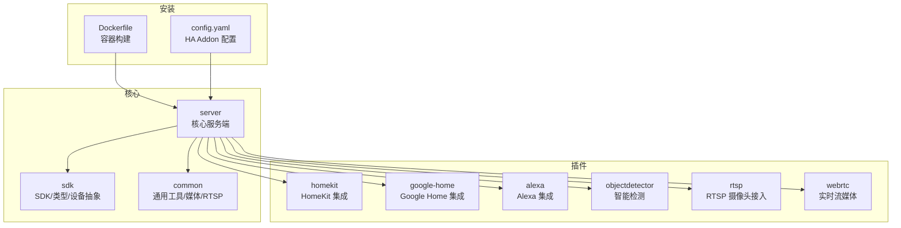
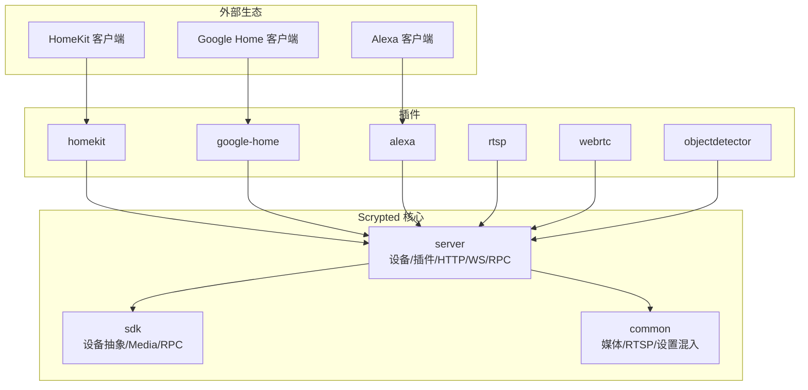
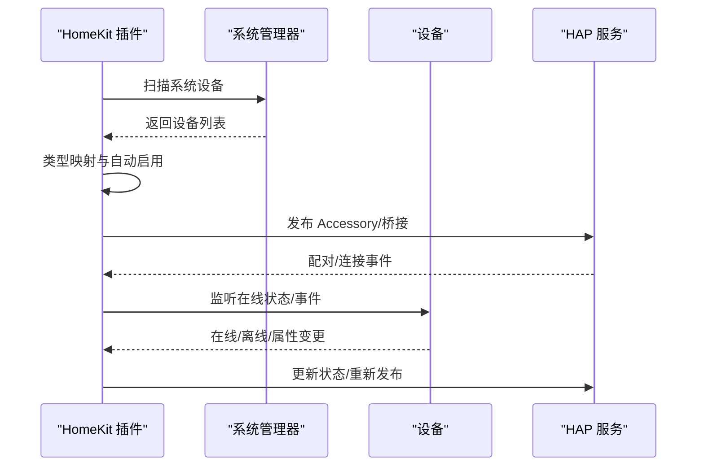
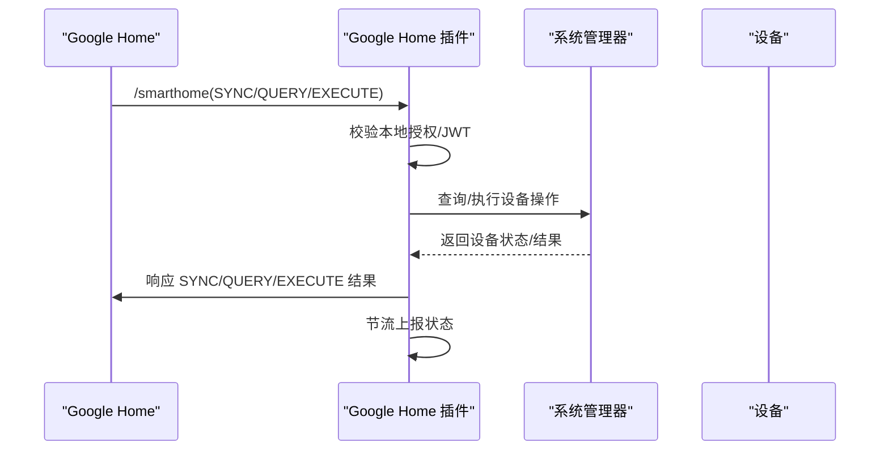
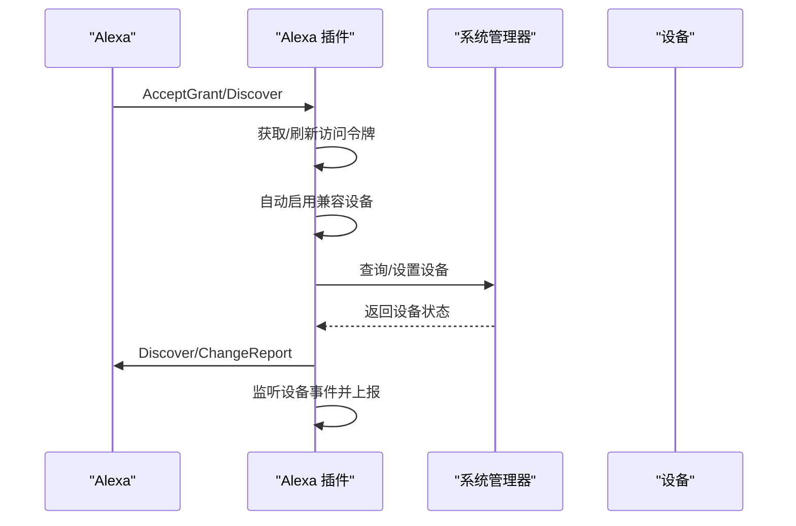
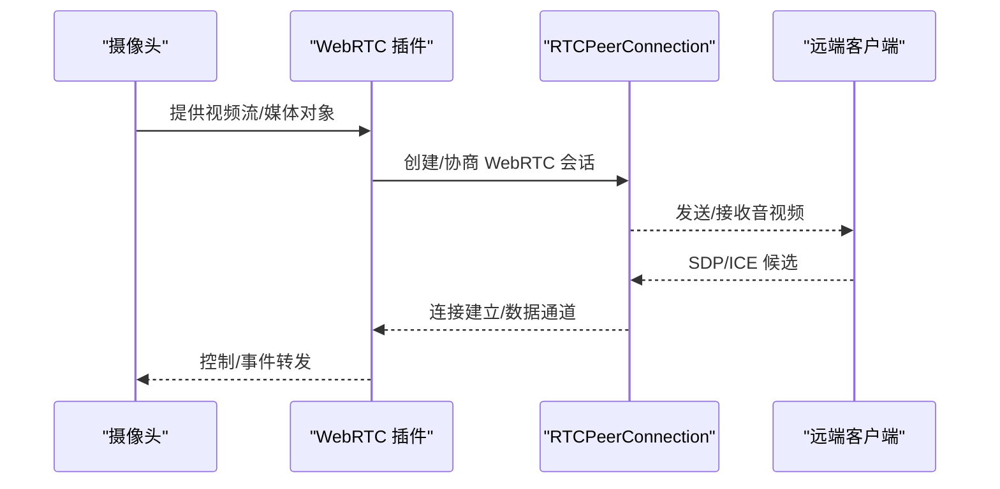
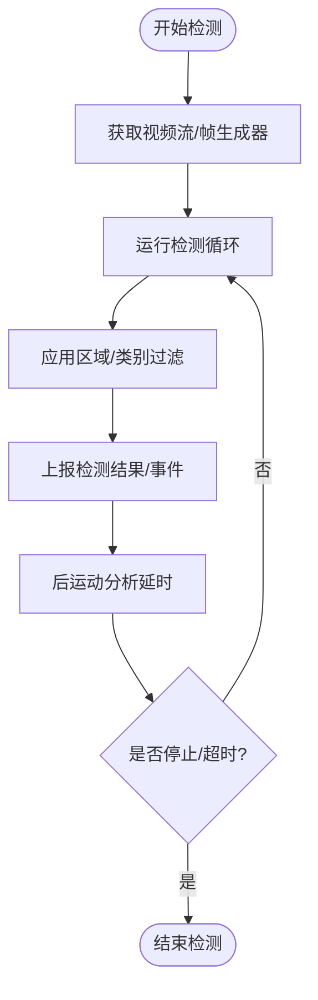
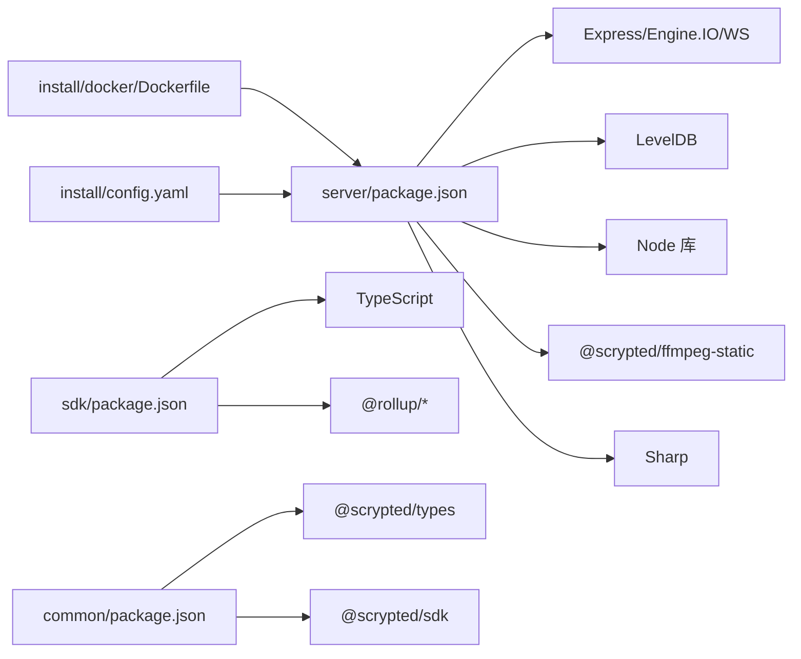

# 项目概述

<cite>
**本文档引用的文件**
- [README.md](file://README.md)
- [repository.yaml](file://repository.yaml)
- [common/package.json](file://common/package.json)
- [server/package.json](file://server/package.json)
- [sdk/package.json](file://sdk/package.json)
- [plugins/core/src/main.ts](file://plugins/core/src/main.ts)
- [plugins/homekit/src/main.ts](file://plugins/homekit/src/main.ts)
- [plugins/google-home/src/main.ts](file://plugins/google-home/src/main.ts)
- [plugins/alexa/src/main.ts](file://plugins/alexa/src/main.ts)
- [plugins/objectdetector/src/main.ts](file://plugins/objectdetector/src/main.ts)
- [plugins/rtsp/src/main.ts](file://plugins/rtsp/src/main.ts)
- [plugins/webrtc/src/main.ts](file://plugins/webrtc/src/main.ts)
- [sdk/src/index.ts](file://sdk/src/index.ts)
- [server/src/scrypted-main.ts](file://server/src/scrypted-main.ts)
- [install/docker/Dockerfile](file://install/docker/Dockerfile)
- [install/config.yaml](file://install/config.yaml)
</cite>

## 目录
1. [简介](#简介)
2. [项目结构](#项目结构)
3. [核心组件](#核心组件)
4. [架构总览](#架构总览)
5. [详细组件分析](#详细组件分析)
6. [依赖关系分析](#依赖关系分析)
7. [性能考量](#性能考量)
8. [故障排查指南](#故障排查指南)
9. [结论](#结论)
10. [附录](#附录)

## 简介
Scrypted 是一个高性能的家庭视频集成平台与 NVR，具备智能检测能力，并可向 HomeKit、Google Home、Alexa 等生态提供低延迟视频流与控制。它通过模块化的插件架构实现对多品牌摄像头与设备的统一接入与管理，同时提供脚本化自动化、媒体转码、WebRTC 实时交互、以及云端/本地协同等能力。

Scrypted 的核心目标是：
- 统一接入：支持主流协议与品牌（如 ONVIF、RTSP、Amcrest、Hikvision、Ring、Wyze 等），并以统一接口暴露给上层生态。
- 智能检测：内置对象检测与运动检测混合模式，支持区域过滤、类别筛选与后处理策略。
- 低延迟流媒体：通过 WebRTC、RTSP、FFmpeg 等链路实现从设备到客户端的低延迟传输。
- 生态集成：通过 HomeKit、Google Home、Alexa 插件，将 Scrypted 设备无缝纳入各自智能家居生态。
- 可扩展性：基于 Node.js + TypeScript 的插件体系，支持第三方开发者快速扩展。

## 项目结构
仓库采用多包（monorepo）组织方式，核心目录说明：
- common：通用工具与公共模块（如媒体辅助、RTSP 服务、设置混入、FFmpeg 辅助等）
- sdk：SDK 与类型定义，提供设备抽象、事件系统、媒体管理、RPC 接口等
- server：Scrypted 核心服务端，负责设备发现、插件托管、HTTP/WebSocket/Engine.IO、RPC、集群等
- plugins：各类插件，覆盖生态集成（HomeKit、Google Home、Alexa）、设备接入（ONVIF、RTSP、Ring 等）、功能增强（WebRTC、对象检测、预缓冲等）
- install：容器与 Home Assistant Addon 安装配置
- packages：部分独立的 npm 包（如 CLI、RPC、流式 Promise 等）

**图表来源**
- [server/src/scrypted-main.ts:1-4](file://server/src/scrypted-main.ts#L1-L4)
- [sdk/src/index.ts:1-297](file://sdk/src/index.ts#L1-L297)
- [plugins/homekit/src/main.ts:1-487](file://plugins/homekit/src/main.ts#L1-L487)
- [plugins/google-home/src/main.ts:1-650](file://plugins/google-home/src/main.ts#L1-L650)
- [plugins/alexa/src/main.ts:1-736](file://plugins/alexa/src/main.ts#L1-L736)
- [plugins/objectdetector/src/main.ts:1-800](file://plugins/objectdetector/src/main.ts#L1-L800)
- [plugins/rtsp/src/main.ts:1-8](file://plugins/rtsp/src/main.ts#L1-L8)
- [plugins/webrtc/src/main.ts:1-776](file://plugins/webrtc/src/main.ts#L1-L776)
- [install/docker/Dockerfile:1-22](file://install/docker/Dockerfile#L1-L22)
- [install/config.yaml:1-49](file://install/config.yaml#L1-L49)

**章节来源**
- [README.md:1-59](file://README.md#L1-L59)
- [repository.yaml:1-4](file://repository.yaml#L1-L4)

## 核心组件
- SDK 与设备抽象：提供统一的设备基类、Mixin 支持、事件系统、媒体管理、RPC 访问等能力，是所有插件开发的基础。
- 核心服务端：负责设备生命周期管理、插件托管、HTTP/WS/Engine.IO、集群与分发、证书与端点管理等。
- 插件体系：按职责拆分为生态集成、设备接入、功能增强三大类，均通过 Mixin 或 Provider 模式接入系统。
- 通用模块：封装媒体处理、FFmpeg 工具、RTSP 服务、设置混入、RTC 连接等复用逻辑。
- 安装与部署：提供 Dockerfile 与 Home Assistant Addon 配置，便于在多种环境中部署运行。

**章节来源**
- [sdk/src/index.ts:1-297](file://sdk/src/index.ts#L1-L297)
- [server/package.json:1-73](file://server/package.json#L1-L73)
- [common/package.json:1-25](file://common/package.json#L1-L25)
- [install/docker/Dockerfile:1-22](file://install/docker/Dockerfile#L1-L22)
- [install/config.yaml:1-49](file://install/config.yaml#L1-L49)

## 架构总览
Scrypted 的整体架构由“核心服务端 + 插件 + SDK”构成，插件通过 Mixin/Provider 模式扩展设备能力；生态集成插件将 Scrypted 设备映射到 HomeKit、Google Home、Alexa；媒体与网络路径通过 WebRTC/RTSP/FFmpeg 等链路完成低延迟传输。

**图表来源**
- [plugins/homekit/src/main.ts:1-487](file://plugins/homekit/src/main.ts#L1-L487)
- [plugins/google-home/src/main.ts:1-650](file://plugins/google-home/src/main.ts#L1-L650)
- [plugins/alexa/src/main.ts:1-736](file://plugins/alexa/src/main.ts#L1-L736)
- [plugins/rtsp/src/main.ts:1-8](file://plugins/rtsp/src/main.ts#L1-L8)
- [plugins/webrtc/src/main.ts:1-776](file://plugins/webrtc/src/main.ts#L1-L776)
- [plugins/objectdetector/src/main.ts:1-800](file://plugins/objectdetector/src/main.ts#L1-L800)
- [server/src/scrypted-main.ts:1-4](file://server/src/scrypted-main.ts#L1-L4)
- [sdk/src/index.ts:1-297](file://sdk/src/index.ts#L1-L297)

## 详细组件分析

### 核心服务端（Server）
- 职责：启动与托管、设备发现与状态管理、HTTP/WS/Engine.IO、RPC 通信、集群与分发、证书与端点管理。
- 关键特性：插件热加载、设备事件总线、媒体转换与转发、安全访问控制、集群工作节点管理。
- 启动入口：通过 scrypted-main 导入并启动主程序。

**章节来源**
- [server/src/scrypted-main.ts:1-4](file://server/src/scrypted-main.ts#L1-L4)
- [server/package.json:1-73](file://server/package.json#L1-L73)

### SDK（设备抽象与 Mixin）
- 职责：提供 ScryptedDeviceBase/MixinDeviceBase、设备状态读写、日志/存储/媒体对象创建、事件广播、RPC 对象连接等。
- 设计要点：通过懒加载获取设备状态与存储，统一事件模型，支持 Mixin 注入扩展设备能力。

**章节来源**
- [sdk/src/index.ts:1-297](file://sdk/src/index.ts#L1-L297)

### 生态集成插件

#### HomeKit 插件
- 功能：将 Scrypted 设备发布为 HomeKit Accessory，支持自动启用、mDNS 广播、QR 码配对、电池信息注入、慢速连接优化等。
- 流程：启动时扫描系统设备，根据类型映射到 HomeKit 类别，自动发布或以独立 Accessory 形式上线。

**图表来源**
- [plugins/homekit/src/main.ts:187-408](file://plugins/homekit/src/main.ts#L187-L408)

**章节来源**
- [plugins/homekit/src/main.ts:1-487](file://plugins/homekit/src/main.ts#L1-L487)

#### Google Home 插件
- 功能：提供 SmartHome V1 协议适配，支持 SYNC/QUERY/EXECUTE/DISCONNECT，本地授权校验，mDNS 广播，RTCSignaling 信令通道。
- 流程：建立本地 HTTP 服务与 mDNS 发布，接收 Google Home 请求，调用系统设备执行命令并上报状态。

**图表来源**
- [plugins/google-home/src/main.ts:266-420](file://plugins/google-home/src/main.ts#L266-L420)

**章节来源**
- [plugins/google-home/src/main.ts:1-650](file://plugins/google-home/src/main.ts#L1-L650)

#### Alexa 插件
- 功能：提供 Alexa 授权、Discover/ChangeReport、设备同步与事件上报、端点管理、令牌刷新与重认证提示。
- 流程：启动时尝试自动启用兼容设备，监听设备事件并上报 Alexa；支持按区域/类别过滤与健康状态上报。

**图表来源**
- [plugins/alexa/src/main.ts:496-687](file://plugins/alexa/src/main.ts#L496-L687)

**章节来源**
- [plugins/alexa/src/main.ts:1-736](file://plugins/alexa/src/main.ts#L1-L736)

### 设备接入与功能增强插件

#### RTSP 插件
- 功能：将 RTSP 摄像头接入为 Scrypted 设备，提供统一的 VideoCamera 接口。
- 入口：导出 RTSPCameraProvider，作为设备创建者。

**章节来源**
- [plugins/rtsp/src/main.ts:1-8](file://plugins/rtsp/src/main.ts#L1-L8)

#### WebRTC 插件
- 功能：提供 RTCSignalingChannel/RTCSignalingClient/Intercom/Display 等能力，支持浏览器直连摄像头、音频/视频转发、TURN/STUN、兼容模式与候选地址过滤。
- 流程：将媒体对象转换为 WebRTC 会话，或从 WebRTC 会话拉取媒体流，支持最大兼容模式与 IPv4/IPv6 候选过滤。

**图表来源**
- [plugins/webrtc/src/main.ts:114-143](file://plugins/webrtc/src/main.ts#L114-L143)

**章节来源**
- [plugins/webrtc/src/main.ts:1-776](file://plugins/webrtc/src/main.ts#L1-L776)

#### 对象检测插件
- 功能：在有内置运动传感器或无内置传感器的设备上，提供对象检测与运动检测混合模式；支持区域过滤、类别筛选、后处理与性能监控。
- 特性：检测会话管理、帧生成器选择、区域裁剪、检测图像保留、性能水位线与系统节流提示。

**图表来源**
- [plugins/objectdetector/src/main.ts:299-537](file://plugins/objectdetector/src/main.ts#L299-L537)

**章节来源**
- [plugins/objectdetector/src/main.ts:1-800](file://plugins/objectdetector/src/main.ts#L1-L800)

### 核心插件（Core）
- 功能：提供系统级设备与服务，如媒体核心、脚本、终端、REPL、用户管理、聚合设备、集群管理等；负责系统设置、地址管理、版本通道与镜像更新等。
- 设计：通过 DeviceProvider 暴露内部系统设备，统一注册与生命周期管理。

**章节来源**
- [plugins/core/src/main.ts:1-414](file://plugins/core/src/main.ts#L1-L414)

## 依赖关系分析
- 技术栈：Node.js、TypeScript、Express、Engine.IO、WebSocket、FFmpeg（静态二进制）、Sharp（图像处理）、Lodash（工具集）、WS（WebSocket）、LevelDB（轻量数据库）等。
- 插件与 SDK：所有插件依赖 @scrypted/sdk 与 @scrypted/types，通过 RPC 与核心服务通信。
- 通用模块：common 包含媒体、RTSP、设置混入、RTC 工具等，被多个插件复用。
- 安装与运行：Dockerfile 使用 noble-full 基础镜像，通过 npm 包安装并启动服务端；Home Assistant Addon 配置暴露必要设备与网络权限。

**图表来源**
- [server/package.json:1-73](file://server/package.json#L1-L73)
- [sdk/package.json:1-62](file://sdk/package.json#L1-L62)
- [common/package.json:1-25](file://common/package.json#L1-L25)
- [install/docker/Dockerfile:1-22](file://install/docker/Dockerfile#L1-L22)
- [install/config.yaml:1-49](file://install/config.yaml#L1-L49)

**章节来源**
- [server/package.json:1-73](file://server/package.json#L1-L73)
- [sdk/package.json:1-62](file://sdk/package.json#L1-L62)
- [common/package.json:1-25](file://common/package.json#L1-L25)

## 性能考量
- 检测性能：对象检测插件内置性能监控，当检测帧率低于阈值时会提示系统可能过载，建议调整检测参数或减少并发检测设备数量。
- 流媒体路径：WebRTC 插件支持最大兼容模式与 TURN/STUN，可在受限网络环境下提升连通性；RTSP 插件提供稳定低延迟链路。
- 资源隔离：通过插件进程与工作节点分离，避免单点阻塞；Docker 部署限制 core dump，确保服务稳定性。
- 编解码与缓存：FFmpeg 静态二进制与 Sharp 图像处理库提供高效媒体处理能力；预缓冲与回放链路减少首帧等待时间。

[本节为通用指导，无需特定文件引用]

## 故障排查指南
- 插件调试：支持在 VS Code 中直接调试插件（如 HomeKit、Google Home、Alexa），无需重启服务端即可热更新。
- 日志与控制台：通过 SDK 的 console/log 获取设备与 Mixin 控制台输出，定位问题。
- 网络与连通性：WebRTC 插件支持 TURN/STUN 与候选地址过滤，若遇到 NAT 限制，可开启 TURN 或自定义 ICE 配置。
- 设备未显示：检查生态插件的自动启用策略与设备类型映射；确认设备已正确接入（如 RTSP/ONVIF）。
- 令牌与授权：Alexa/Google Home 插件需要有效的授权令牌与配对密钥，若失效需重新授权并刷新令牌。

**章节来源**
- [README.md:15-59](file://README.md#L15-L59)
- [plugins/homekit/src/main.ts:187-408](file://plugins/homekit/src/main.ts#L187-L408)
- [plugins/google-home/src/main.ts:584-646](file://plugins/google-home/src/main.ts#L584-L646)
- [plugins/alexa/src/main.ts:612-687](file://plugins/alexa/src/main.ts#L612-L687)
- [plugins/webrtc/src/main.ts:558-631](file://plugins/webrtc/src/main.ts#L558-L631)

## 结论
Scrypted 以模块化插件架构为核心，结合统一的 SDK 抽象与强大的媒体处理能力，实现了对多生态与多协议设备的统一接入与低延迟流媒体传输。其智能检测、WebRTC 实时交互、生态集成与可扩展的开发体验，使其成为家庭视频与自动化领域的高性能平台选择。

[本节为总结，无需特定文件引用]

## 附录

### 开发与部署指引
- 本地开发：克隆仓库，执行 npm-install.sh 安装依赖，使用 VS Code 打开对应插件项目进行调试。
- 容器部署：使用 install/docker/Dockerfile 构建镜像，默认启动服务端；可通过环境变量与卷挂载定制数据与 NVR 存储。
- Home Assistant Addon：参考 install/config.yaml 配置，启用必要的设备与网络权限，映射媒体与共享目录。

**章节来源**
- [README.md:15-59](file://README.md#L15-L59)
- [install/docker/Dockerfile:1-22](file://install/docker/Dockerfile#L1-L22)
- [install/config.yaml:1-49](file://install/config.yaml#L1-L49)